# Doki — Architecture

This document describes the component structure, interfaces, deployment topology, and module boundaries.

---

## Component Overview

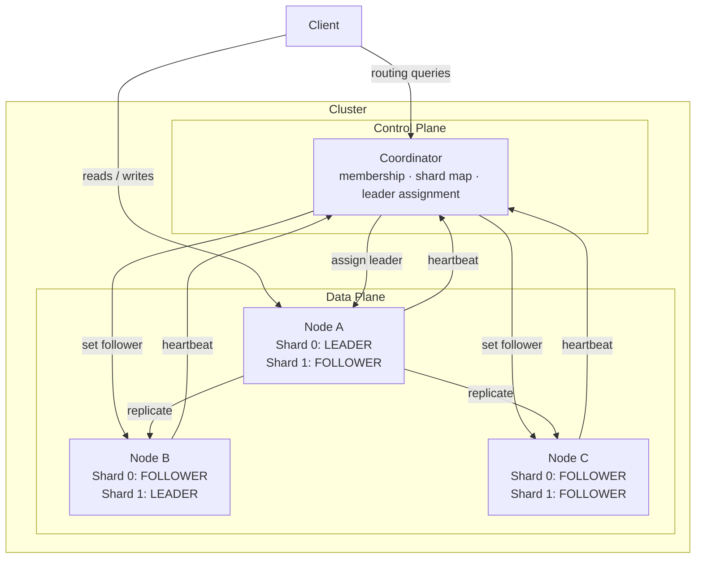

---

## Module Structure

```
doki/
├── cmd/
│   ├── coordinator/          # Entry point: coordinator binary
│   └── node/                 # Entry point: node binary
├── coordinator/              # Coordinator library
│   ├── membership.go         # Node registry, heartbeat tracking, dynamic join
│   ├── leader.go             # Leader assignment logic
│   ├── migration.go          # MigrationManager: live shard migration + split (Phase 5)
│   └── server.go             # HTTP server + handlers
├── node/                     # Node library
│   ├── replica.go            # Per-shard ReplicaState
│   ├── election.go           # Distributed leader election (Phase 4)
│   ├── recovery.go           # Incremental + bootstrap recovery (Phase 3 / 5)
│   ├── replication.go        # Quorum replication fan-out
│   ├── diskstate.go          # WAL + snapshot per shard (Phase 2)
│   └── server.go             # HTTP server + handlers, heartbeat loop
├── internal/
│   ├── clock/                # Clock interface (real + fake)
│   ├── config/               # Config types and YAML loading
│   ├── metrics/              # Prometheus metrics definitions
│   ├── replicationlog/       # Bounded circular replication log (Phase 3)
│   ├── shardmap/             # ShardMap types and operations
│   ├── snapshot/             # Atomic disk snapshot (Phase 2)
│   ├── storage/              # Storage interface + implementations
│   │   └── memory/           # In-memory storage engine
│   └── wal/                  # Write-ahead log (Phase 2)
├── internal/
│   ├── sql/                  # SQL compiler pipeline (Phase 6-9)
│   │   ├── token.go          # Token types
│   │   ├── lexer.go          # Tokenizer
│   │   ├── ast.go            # AST node types
│   │   ├── parser.go         # Recursive descent parser
│   │   ├── catalog.go        # Schema catalog + KV row encoding
│   │   ├── analyzer.go       # Semantic analysis + type checking
│   │   ├── planner.go        # Physical plan generation + optimizer
│   │   └── executor.go       # Plan execution against KV interface
├── test/
│   ├── integration/          # End-to-end tests (real servers, no Docker)
│   └── reliability/          # Chaos, load, and monkey tests (build tag: reliability)
├── proto/                    # Protobuf definitions (gRPC, Phase 1+)
│   ├── common.proto
│   ├── coordinator.proto
│   └── node.proto
├── config/                   # Example YAML configs
└── docker/                   # Dockerfiles + docker-compose
```

---

## Component Interfaces

### Coordinator → Node (Phase 1+, HTTP/JSON)

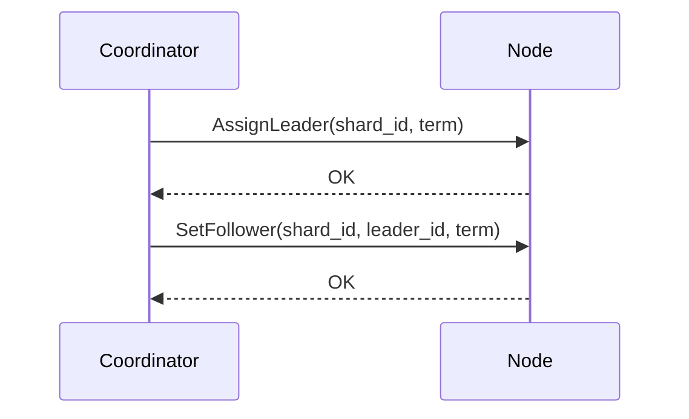

### Node → Coordinator (HTTP/JSON)

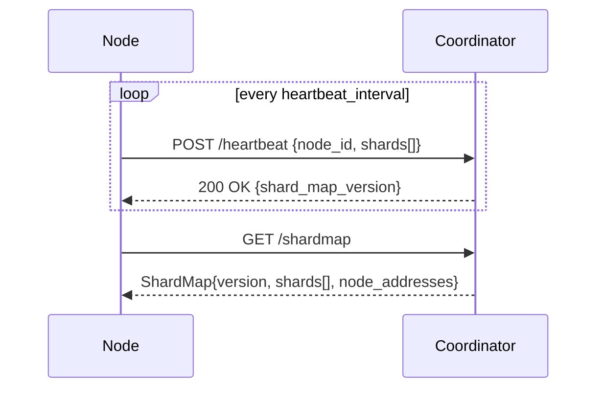

### Operator → Coordinator: Dynamic Cluster Management (Phase 5)

```mermaid
sequenceDiagram
    participant OP as Operator
    participant C as Coordinator

    OP->>C: POST /admin/add_node {node_id, address}
    C-->>OP: 200 OK

    OP->>C: POST /admin/migrate_shard {shard_id, new_replicas}
    C-->>OP: 200 {status: migrating}
    note over C: background: shard_map version bumps,\nnew nodes recover, migration finalises

    OP->>C: POST /admin/split_shard {source_shard_id, new_shard_id, new_replicas}
    C-->>OP: 200 {status: splitting}
    note over C: new shard bootstraps from source;\nbootstrap hint cleared when all replicas ready
```

---

## Data Flow: Write Path

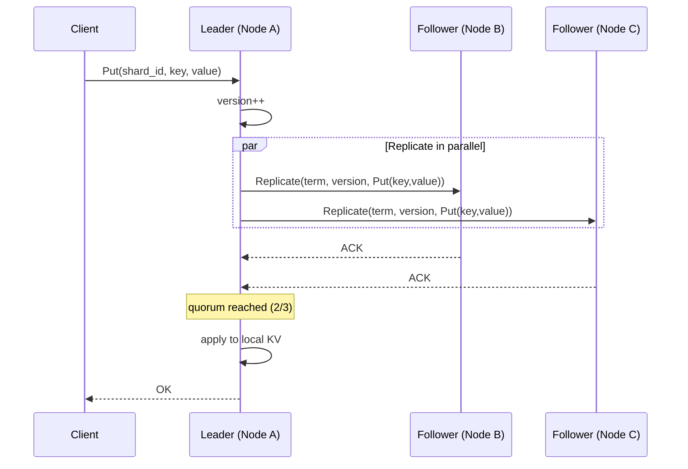

---

## Data Flow: Read Path

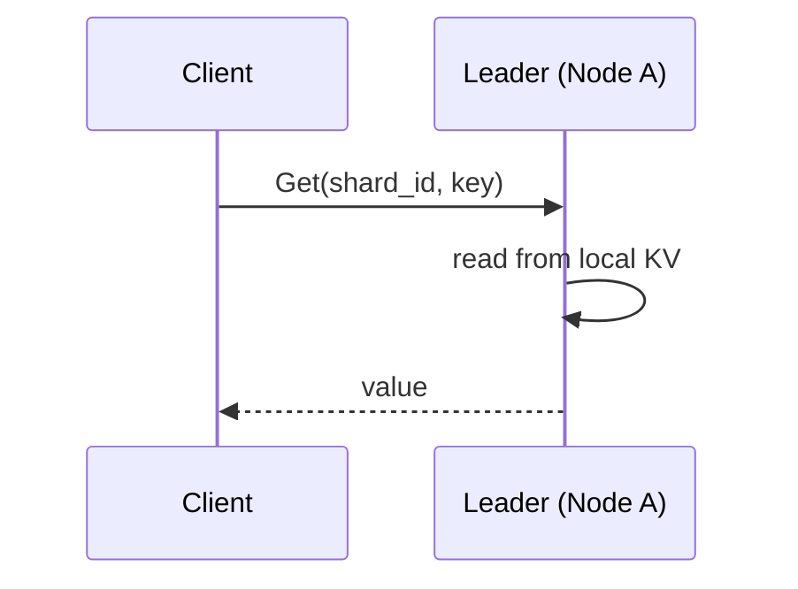

If the client reaches a follower by mistake:

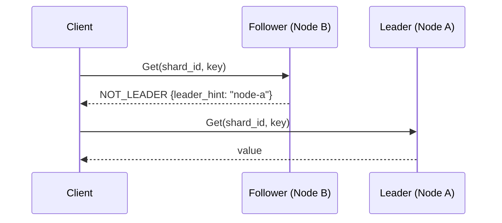

---

## Data Flow: Recovery

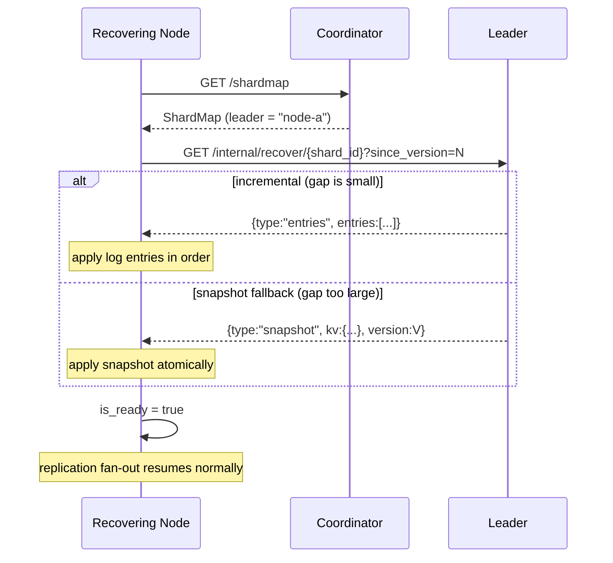

---

## Data Flow: Shard Migration (Phase 5)

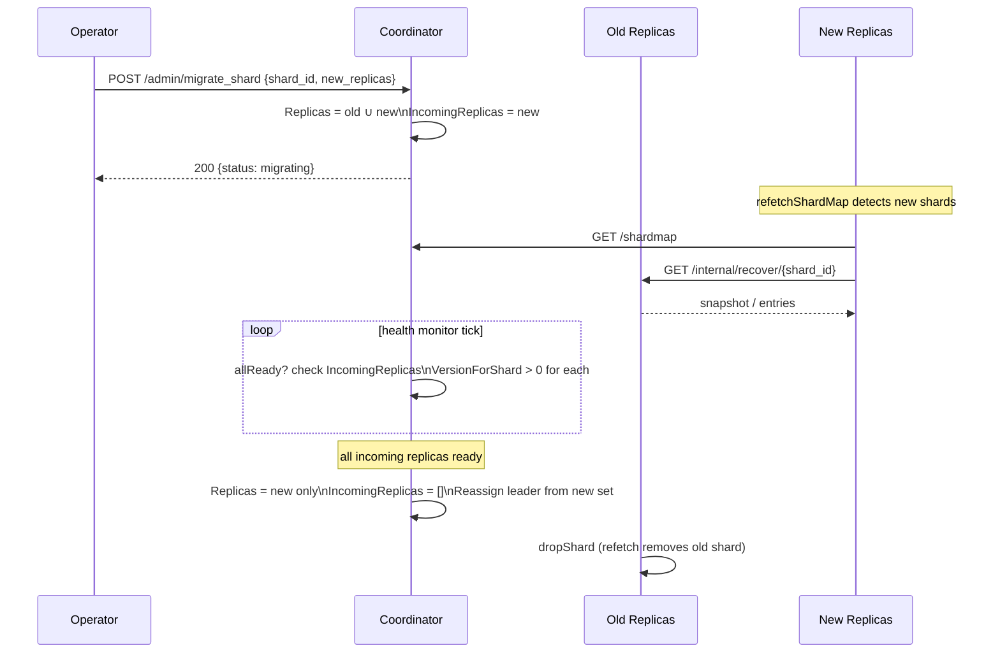

---

## Data Flow: Shard Split (Phase 5)

```mermaid
sequenceDiagram
    participant OP as Operator
    participant CO as Coordinator
    participant SRC as Source Shard Leader
    participant NEW as New Shard Nodes

    OP->>CO: POST /admin/split_shard {source, new_shard, new_replicas}
    CO->>CO: Create new shard with BootstrapSourceShardID=source
    CO-->>OP: 200 {status: splitting}

    NEW->>CO: GET /shardmap
    note over NEW: BootstrapSourceShardID set; is_ready=false
    NEW->>SRC: GET /internal/recover/{source_shard_id}?since_version=0
    SRC-->>NEW: snapshot of source shard

    note over NEW: apply snapshot; clear BootstrapSourceShardID; is_ready=true
    loop health monitor tick
        CO->>CO: allReady? IncomingReplicas VersionForShard > 0
    end
    CO->>CO: ClearBootstrapSource; IncomingReplicas=[]\nAssign leader for new shard
```

---

## Replica State Machine

```mermaid
stateDiagram-v2
    [*] --> NOT_READY : node starts / restarts

    NOT_READY --> NOT_READY : Bootstrap recovery in progress\n(BootstrapShardID set; fetching source shard)

    NOT_READY --> READY : recovery complete\n(snapshot/entries applied; is_ready=true)

    READY --> READY : Replicate(version = v+1) received; apply + ACK

    READY --> NOT_READY : gap detected (version != v+1)\nOR lag > max_lag_versions\n→ trigger recovery

    READY --> LEADER : AssignLeader received from coordinator

    LEADER --> FOLLOWER : TERM_MISMATCH received\n(stale leader detected)

    LEADER --> LEADER : write committed; Replicate sent to followers

    FOLLOWER --> LEADER : AssignLeader received (new election)
```

---

## Deployment Topology

### Docker Compose (Development)

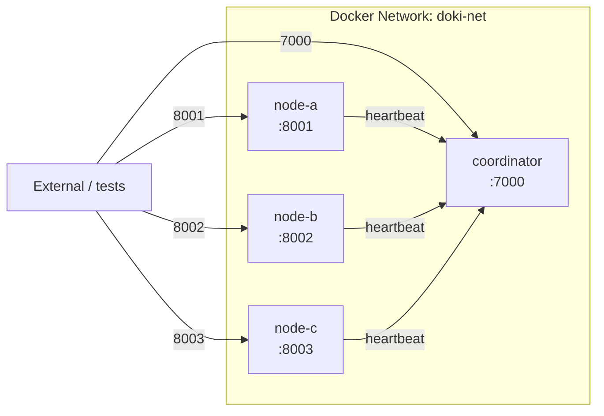

### Startup Order

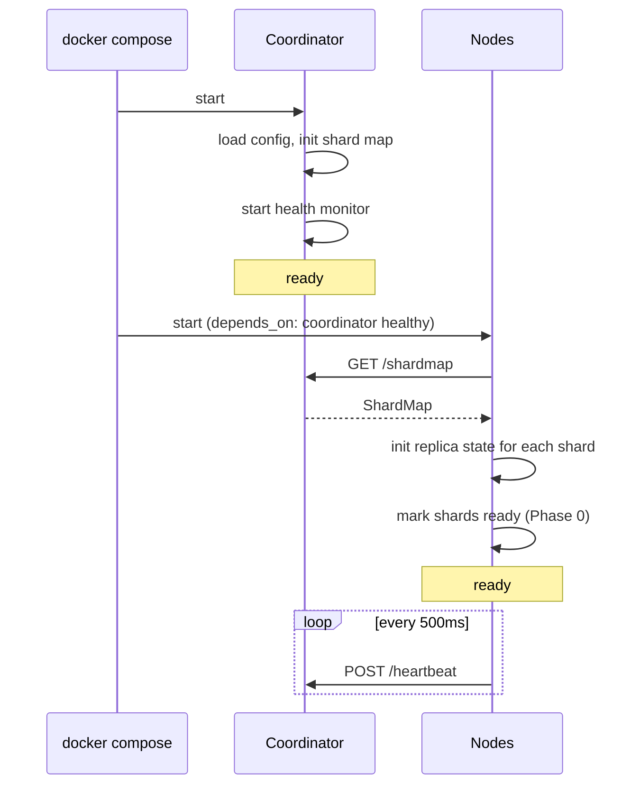

---

## Process Lifecycle

### Node Startup

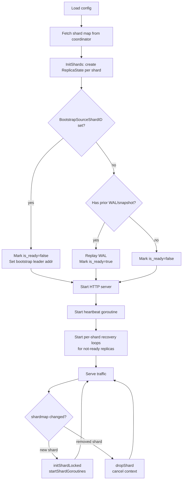

### Coordinator Startup

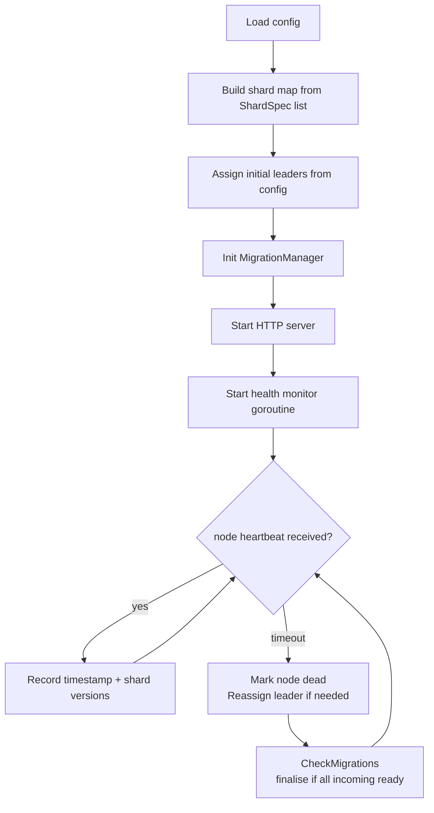

---

## Error Codes

| Code | Meaning |
|------|---------|
| `OK` | Success |
| `NOT_LEADER` | Request went to a follower; includes leader hint |
| `WRONG_NODE` | Request went to a node that doesn't host this shard |
| `NOT_FOUND` | Key does not exist |
| `QUORUM_UNAVAILABLE` | Leader could not reach quorum in time |
| `TERM_MISMATCH` | Sender's term is lower than receiver's term |
| `NOT_READY` | Replica is still recovering |
| `INTERNAL_ERROR` | Unexpected error; see logs |

---

## Concurrency Model

### Per-Node

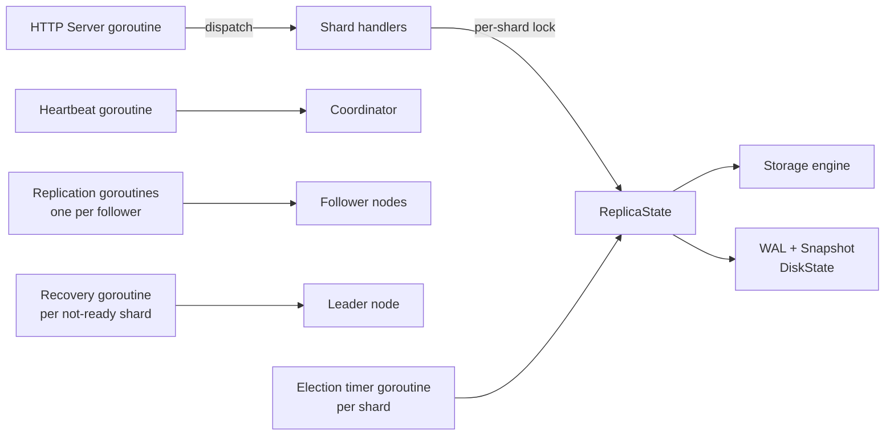

Each shard's `ReplicaState` is protected by its own `sync.RWMutex`. No shard lock is ever held while acquiring another shard's lock.

Each shard also has its own `context.CancelFunc` stored in the node's `cancelFuncs` map. When a shard is removed (e.g. after migration away), `dropShard` cancels the context, stopping all background goroutines for that shard cleanly.

The coordinator uses a single `sync.RWMutex` for its state — acceptable in v1.

---

## SQL Compiler Pipeline (Phase 6-9)

The SQL layer sits above the KV engine. It compiles SQL text into KV operations through a standard compiler pipeline:

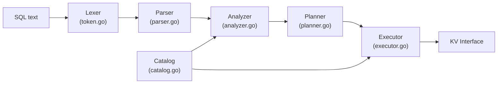

### Stages

| Stage | Input | Output | Responsibility |
|-------|-------|--------|---------------|
| Lexer | SQL string | `[]Token` | Tokenise; skip whitespace and `--` comments |
| Parser | `[]Token` | `Statement` (AST) | Recursive descent; grammar for CREATE/INSERT/SELECT/UPDATE/DELETE |
| Analyzer | `Statement` + `Catalog` | `ResolvedStatement` | Name resolution, type checking, PK WHERE enforcement |
| Planner | `ResolvedStatement` | `PhysicalPlan` | Map to KV operations; optimize PK WHERE → PointGet |
| Executor | `PhysicalPlan` + `KV` + `Catalog` | `*ResultSet` | Execute KV ops; encode/decode JSON rows; project columns |

### Physical Plan Types

| Plan | KV Operation | When used |
|------|-------------|-----------|
| `PointGet` | `kv.Get(table/pk)` | SELECT WHERE pk = ? |
| `TableScan` | `kv.Scan(table/)` | SELECT with no WHERE |
| `InsertPlan` | `kv.Put(table/pk, row)` | INSERT |
| `PointUpdate` | `kv.Get` + `kv.Put` | UPDATE WHERE pk = ? |
| `PointDelete` | `kv.Delete(table/pk)` | DELETE WHERE pk = ? |
| `CreateTablePlan` | `catalog.CreateTable` | CREATE TABLE |

### KV Encoding

Rows are stored as JSON at keys of the form `table/pk_value`:
```
key:   "users/42"
value: {"id":42,"name":"alice","active":true}
```

### Supported SQL (v1)

```sql
CREATE TABLE users (id INT PRIMARY KEY, name TEXT NOT NULL, active BOOL);
INSERT INTO users VALUES (1, 'alice', true);
INSERT INTO users (id, name) VALUES (2, 'bob');
SELECT * FROM users;
SELECT id, name FROM users WHERE id = 1;
UPDATE users SET name = 'alice2' WHERE id = 1;
DELETE FROM users WHERE id = 1;
```

---

## Security (v1: None)

v1 has no authentication, authorization, or encryption. All traffic is plaintext HTTP/JSON (Phase 0) or plaintext gRPC (Phase 1+). This is acceptable for a local development and learning environment.

Future: mTLS for node-to-node communication; token-based auth for clients.
