# Doki — Architecture

This document describes the component structure, interfaces, deployment topology, and module boundaries.

---

## Component Overview

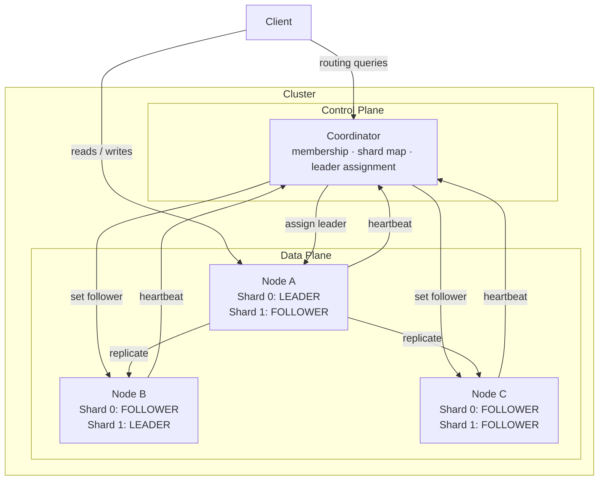

---

## Module Structure

```
doki/
├── cmd/
│   ├── coordinator/          # Entry point: coordinator binary
│   └── node/                 # Entry point: node binary
├── coordinator/              # Coordinator library
│   ├── membership.go         # Node registry, heartbeat tracking
│   ├── leader.go             # Leader assignment logic
│   └── server.go             # HTTP server + handlers
├── node/                     # Node library
│   ├── replica.go            # Per-shard ReplicaState
│   └── server.go             # HTTP server + handlers, heartbeat loop
├── internal/
│   ├── clock/                # Clock interface (real + fake)
│   ├── config/               # Config types and YAML loading
│   ├── shardmap/             # ShardMap types and operations
│   └── storage/              # Storage interface + implementations
│       └── memory/           # In-memory storage engine (v1)
├── test/
│   └── integration/          # End-to-end tests (real servers, no Docker)
├── proto/                    # Protobuf definitions (gRPC, Phase 1+)
│   ├── common.proto
│   ├── coordinator.proto
│   └── node.proto
├── config/                   # Example YAML configs
└── docker/                   # Dockerfiles + docker-compose
```

---

## Component Interfaces

### Coordinator → Node (Phase 1+, gRPC)

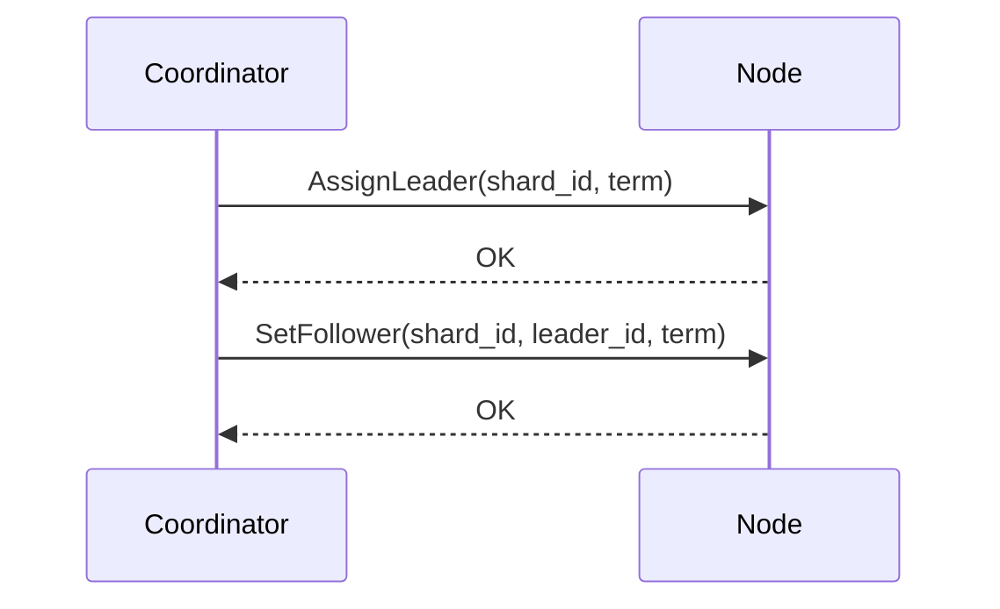

### Node → Coordinator (HTTP, Phase 0; gRPC, Phase 1+)

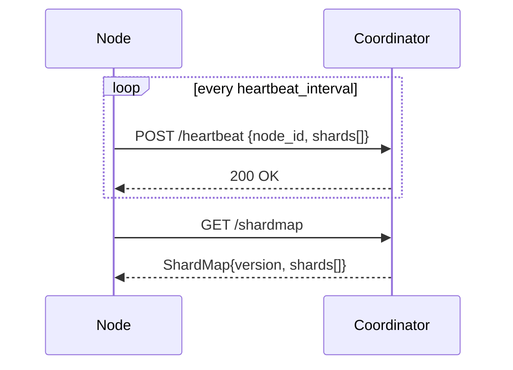

---

## Data Flow: Write Path

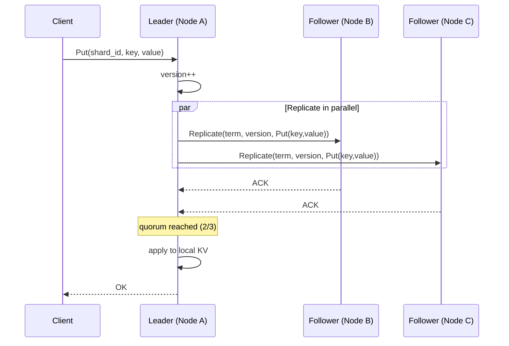

---

## Data Flow: Read Path

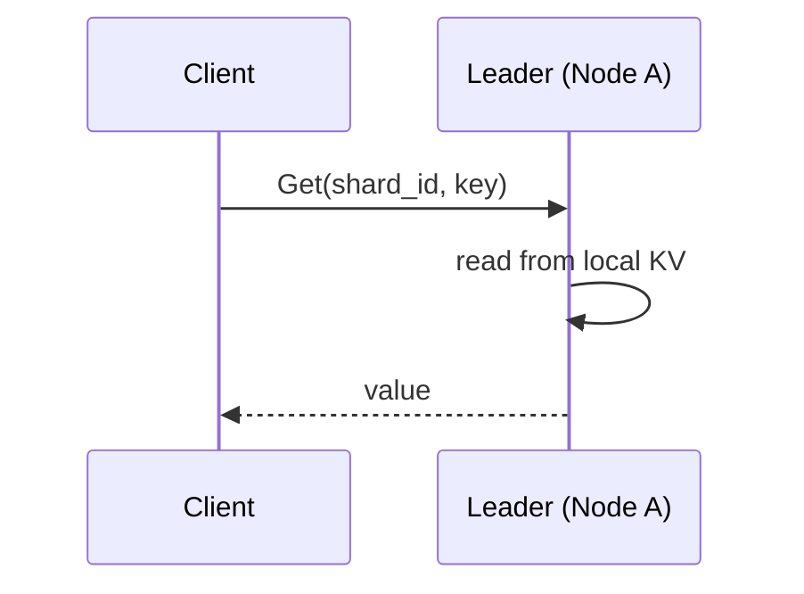

If the client reaches a follower by mistake:

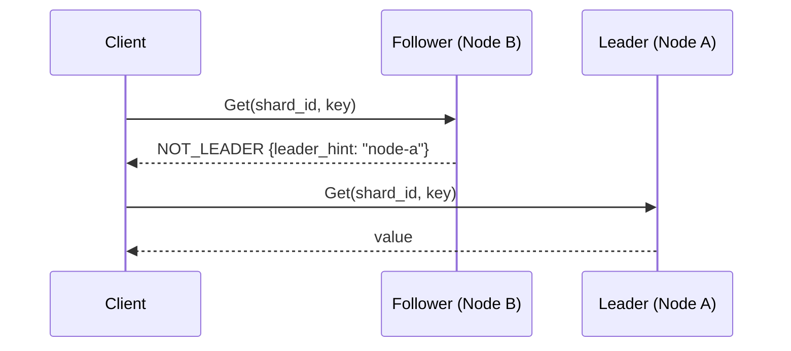

---

## Data Flow: Recovery

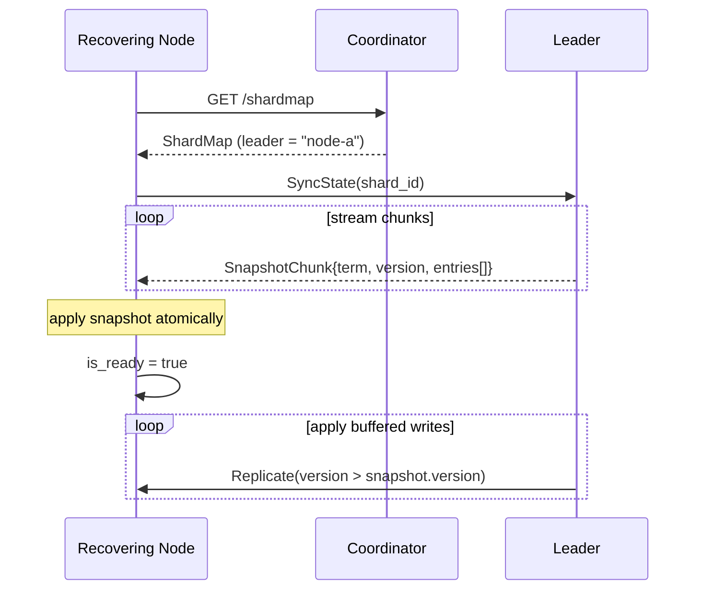

---

## Replica State Machine

```mermaid
stateDiagram-v2
    [*] --> NOT_READY : node starts / restarts

    NOT_READY --> READY : snapshot received and applied

    READY --> READY : Replicate(version = v+1) received; apply + ACK

    READY --> NOT_READY : gap detected (version != v+1)\nOR lag > max_lag_versions\n→ trigger recovery

    READY --> LEADER : AssignLeader received from coordinator

    LEADER --> FOLLOWER : TERM_MISMATCH received\n(stale leader detected)

    LEADER --> LEADER : write committed; Replicate sent to followers

    FOLLOWER --> LEADER : AssignLeader received (new election)
```

---

## Deployment Topology

### Docker Compose (Development)

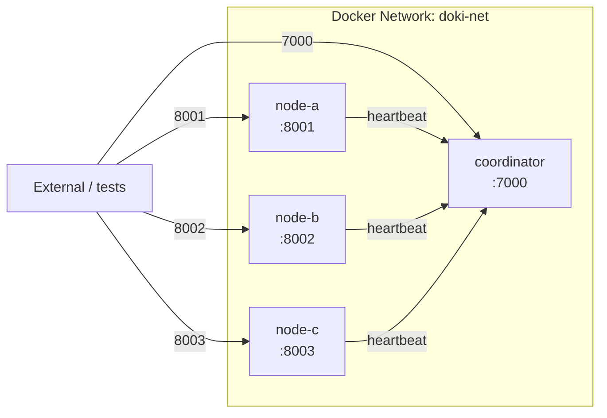

### Startup Order

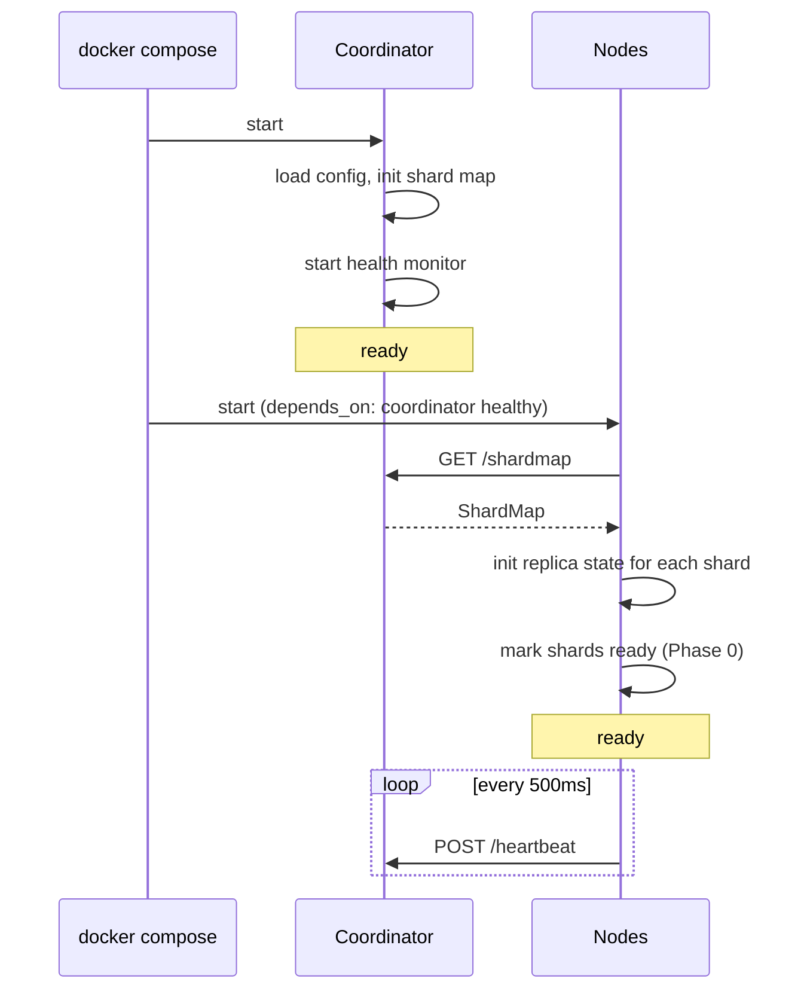

---

## Process Lifecycle

### Node Startup

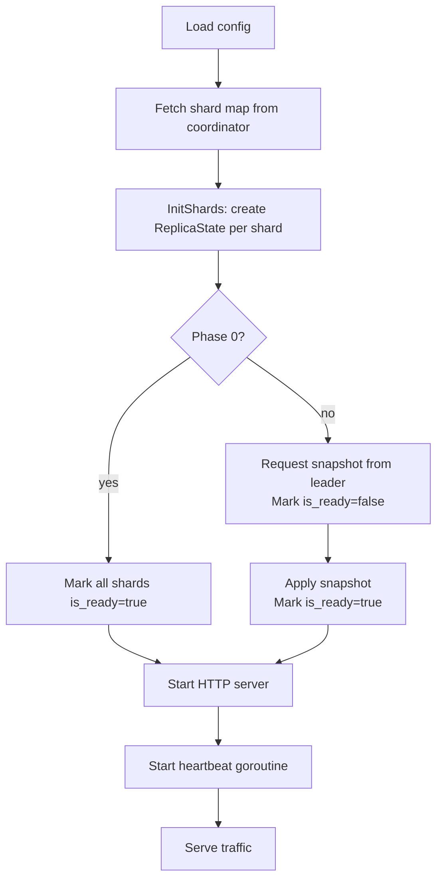

### Coordinator Startup

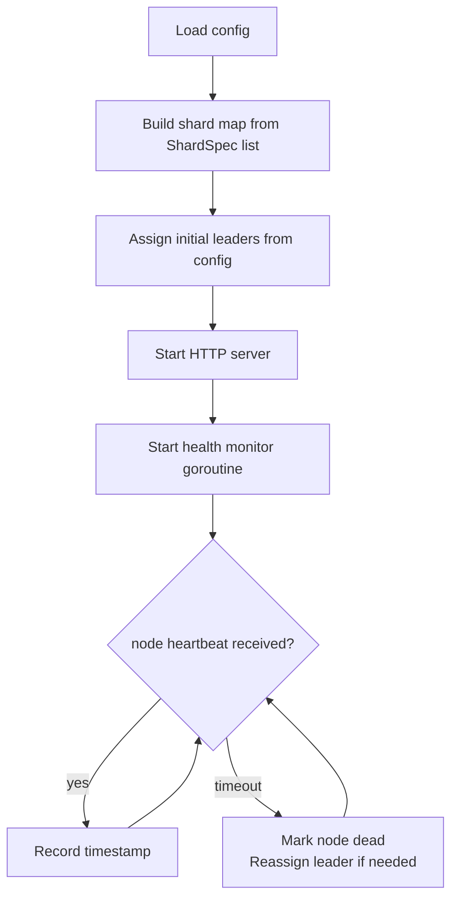

---

## Error Codes

| Code | Meaning |
|------|---------|
| `OK` | Success |
| `NOT_LEADER` | Request went to a follower; includes leader hint |
| `WRONG_NODE` | Request went to a node that doesn't host this shard |
| `NOT_FOUND` | Key does not exist |
| `QUORUM_UNAVAILABLE` | Leader could not reach quorum in time |
| `TERM_MISMATCH` | Sender's term is lower than receiver's term |
| `NOT_READY` | Replica is still recovering |
| `INTERNAL_ERROR` | Unexpected error; see logs |

---

## Concurrency Model

### Per-Node

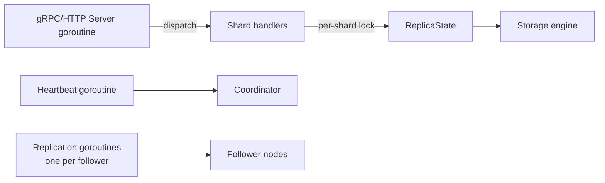

Each shard's `ReplicaState` is protected by its own `sync.RWMutex`. No shard lock is ever held while acquiring another shard's lock.

The coordinator uses a single `sync.RWMutex` for its state — acceptable in v1.

---

## Security (v1: None)

v1 has no authentication, authorization, or encryption. All traffic is plaintext HTTP/JSON (Phase 0) or plaintext gRPC (Phase 1+). This is acceptable for a local development and learning environment.

Future: mTLS for node-to-node communication; token-based auth for clients.
