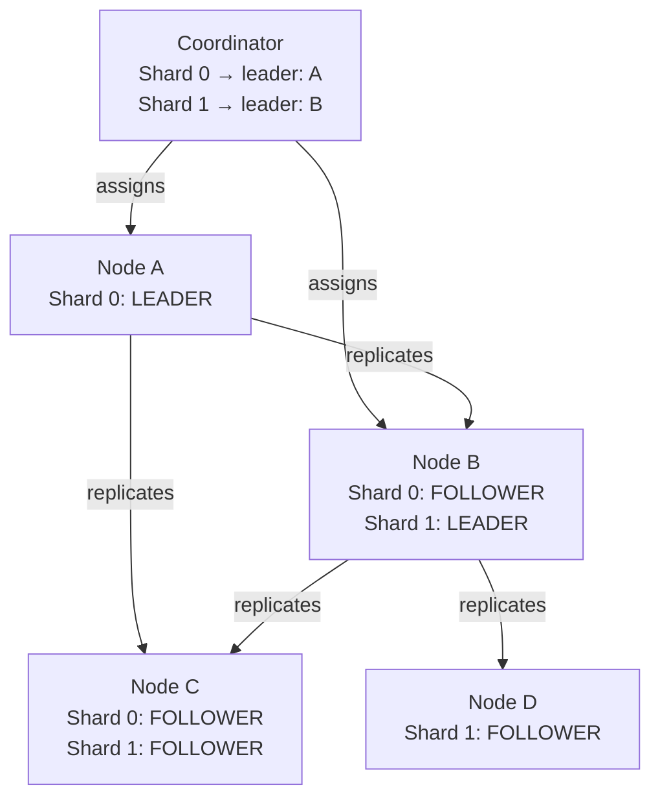
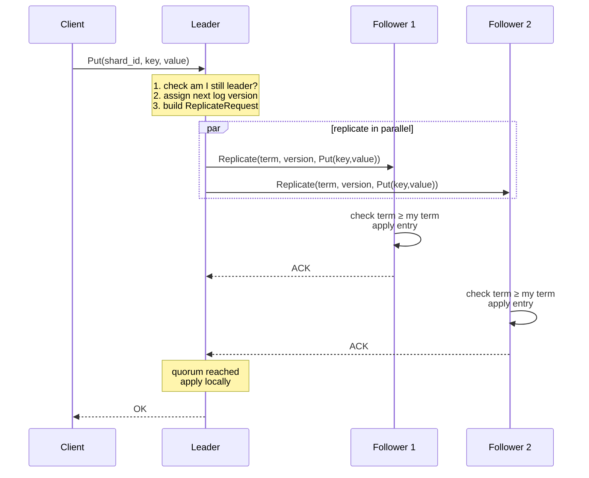

# Doki — Design Document

This document is the authoritative reference for Doki's design. It covers semantics, data models, protocols, component contracts, and the open questions that will shape future evolution.

---

## Table of Contents

1. [Vision & Philosophy](#1-vision--philosophy)
2. [System Overview](#2-system-overview)
3. [Semantics](#3-semantics)
4. [Data Model](#4-data-model)
5. [Sharding](#5-sharding)
6. [Replica State Model](#6-replica-state-model)
7. [Write Protocol](#7-write-protocol)
8. [Read Protocol](#8-read-protocol)
9. [Replication](#9-replication)
10. [Recovery](#10-recovery)
11. [Leader Assignment](#11-leader-assignment)
12. [Request Routing](#12-request-routing)
13. [Coordinator](#13-coordinator)
14. [Failure Handling](#14-failure-handling)
15. [Storage Engine](#15-storage-engine)
16. [Health & Observability](#16-health--observability)
17. [Wire Protocol](#17-wire-protocol)
18. [Configuration](#18-configuration)
19. [Open Questions](#19-open-questions)

---

## 1. Vision & Philosophy

### Goal

Doki is a learning-focused distributed database. Its purpose is to make distributed systems concepts concrete by building a real, runnable, testable system.

Doki is not a production system. It is optimized for:

- **Clarity** — every mechanism should be understandable without deep prior expertise
- **Correctness** — a wrong answer delivered fast is worse than a slow correct one
- **Testability** — the system should be easy to exercise, observe, and break deliberately
- **Incremental evolution** — new complexity should be addable without rewriting core components

### What Doki Is Not

- A performance benchmark
- A replacement for etcd, CockroachDB, or any production system
- A complete Raft implementation
- A Byzantine-fault-tolerant system

### Guiding Principles

| Principle | Implication |
|-----------|-------------|
| Correctness first | Quorum is required; no degraded writes |
| Simple over clever | Full-state snapshots, not incremental log replay in v1 |
| Build in layers | Each component has a clear interface and can be tested alone |
| Observable by default | Every node exposes structured status |
| Embrace evolution | v1 is not the last word; design for extension |

---

## 2. System Overview

### Components

#### Coordinator

The coordinator is the **control plane**. It is a single process (no HA in v1) responsible for:

- Maintaining the cluster membership list (statically configured at startup; dynamic join supported via `POST /admin/add_node`)
- Defining the shard map: which nodes host which shards
- Assigning leaders to shards
- Serving routing metadata to clients and nodes
- Detecting node failures via heartbeat
- Managing live shard migration and shard splitting (Phase 5)

The coordinator does not store user data. It stores only metadata.

#### Leaf Nodes

Each leaf node is a **data plane** process responsible for:

- Hosting one or more shard replicas
- Participating in replication as leader or follower
- Serving client reads (leader only)
- Applying writes from leader (follower)
- Exposing health and status

#### Clients

Clients are the external interface. In v1 they:

- Issue `Put(key, value)`, `Delete(key)`, `Get(key)` requests
- May contact any node
- Are redirected or proxied to the leader if needed
- Query the coordinator for routing hints (shard map)

---

### Topology Example



---

## 3. Semantics

### Consistency Model

Doki provides **linearizability per shard**.

- All operations on a shard appear to execute atomically and in some total order consistent with real time
- The leader defines this order
- A client always sees a result consistent with all prior acknowledged writes

Cross-shard operations do not have atomicity guarantees in v1.

### Write Semantics

A write is **committed** when it has been replicated to a quorum (majority) of replicas.

For a 3-replica shard: quorum = 2 (leader + 1 follower).

A committed write is guaranteed to survive the loss of any minority of replicas.

A write that cannot reach quorum **fails**. The system does not degrade to eventual consistency.

### Read Semantics

All reads are served by the **leader**. This ensures reads always see the latest committed state.

Followers do not serve reads directly. They may proxy to the leader.

> **Decision:** Leader-only reads are simple and correct. Stale reads from followers introduce complexity (read leases, versioned reads) that is not worth it in v1.

### Failure Semantics

Doki uses a **crash-stop** failure model:

- A failed node stops and does not resume with corrupted state
- Nodes do not send incorrect messages (no Byzantine behavior)
- Network partitions may occur but are not fully handled in v1

Under a partition, if a shard's leader cannot reach quorum, writes fail. No split-brain writes are permitted.

### Availability Trade-off

Doki explicitly chooses **consistency over availability** (CP in CAP terms):

- If quorum is unavailable, writes fail
- The system does not attempt to serve stale reads or accept degraded writes
- This is a deliberate learning choice — implementing CA would undermine the purpose

---

## 4. Data Model

### Keyspace

The keyspace is a flat namespace of byte-string keys. Keys are arbitrary byte sequences. Values are arbitrary byte sequences.

```
key:   []byte   (arbitrary, no structure enforced at storage layer)
value: []byte
```

### Operations

| Operation | Description |
|-----------|-------------|
| `Put(key, value)` | Write or overwrite a key |
| `Delete(key)` | Remove a key |
| `Get(key)` | Read a key; returns value or not-found |

There is no scan, range query, or transaction in v1.

### Versioning

Each shard has a monotonically increasing **version counter**. The version increments on every committed write. This is used for:

- Replication ordering
- Recovery state comparison
- Follower lag detection

The version is a 64-bit unsigned integer. It starts at 0 and never resets (unless a node is fully rebuilt from a snapshot).

---

## 5. Sharding

### Static + Dynamic Shards (Phase 5)

Shards can be defined statically in the coordinator's configuration file at startup **and** created/migrated dynamically at runtime without restarting the cluster.

Each shard has:
- A shard ID (e.g., `shard-0`, `shard-1`)
- A set of replica nodes
- An assigned leader (may change via coordinator)
- (During migration) an `incoming_replicas` list of nodes still catching up
- (During split) a `bootstrap_source_shard_id` pointing to the source shard to copy data from

Example static configuration:

```yaml
shards:
  - id: shard-0
    replicas: [node-a, node-b, node-c]
    initial_leader: node-a

  - id: shard-1
    replicas: [node-b, node-c, node-d]
    initial_leader: node-b
```

### Dynamic Operations

**Add Node** — Register a new node so it can receive heartbeats and be assigned shard replicas:
```
POST /admin/add_node {node_id, address}
```

**Migrate Shard** — Move a shard's replica set to new nodes without downtime:
```
POST /admin/migrate_shard {shard_id, new_replicas}
```
The coordinator sets `Replicas = old ∪ new` (dual-serving window) and `IncomingReplicas = new`. New nodes recover from the current leader. Once all incoming replicas have `VersionForShard > 0`, the coordinator finalises: sets `Replicas = new` and assigns a leader from the new set. Old nodes detect the change via `refetchShardMap` and drop the shard.

**Split Shard** — Create a new shard bootstrapped from an existing shard:
```
POST /admin/split_shard {source_shard_id, new_shard_id, new_replicas}
```
The new shard is created with `BootstrapSourceShardID = source_shard_id`. New nodes recover the source shard's full snapshot rather than their own (empty) shard. Once recovery is complete, the bootstrap hint is cleared and the new shard operates independently.

### Shard Map

The **shard map** is the coordinator's view of the current shard layout. It is versioned (monotonically incrementing integer) so clients can detect staleness.

```
ShardMap {
  version:        uint64
  shards:         map<ShardId, ShardInfo>
  node_addresses: map<NodeId, string>
}

ShardInfo {
  shard_id:                ShardId
  replicas:                []NodeId
  leader:                  NodeId
  incoming_replicas:       []NodeId   // non-empty during migration
  bootstrap_source_shard_id: ShardId  // non-empty during shard split
}
```

### Key Routing

Key-to-shard routing is explicit: the caller specifies the shard ID directly in each request. There is no automatic hash-based routing in v1.

> **Decision for v1:** Explicit shard targeting keeps routing simple. Clients and operators are responsible for choosing the right shard. Hash-based routing can be added as a thin client-side layer.

### Shard Map Caching

Clients and nodes cache the shard map. When a request is routed incorrectly (e.g., to a stale leader), the receiving node returns a `NOT_LEADER` response with the current leader hint. The client updates its cache and retries.

Nodes poll the coordinator for shard map updates every heartbeat interval (`refetchShardMap`) and react to changes: starting goroutines for new shards and dropping shards they are no longer assigned to.

---

## 6. Replica State Model

Each replica maintains the following state:

```
ReplicaState {
  shard_id:              ShardId          // which shard this replica serves
  node_id:               NodeId           // identity of this node
  role:                  Role             // LEADER or FOLLOWER
  leader_id:             NodeId           // current known leader for this shard
  term:                  uint64           // leader epoch; incremented on each new leader
  version:               uint64           // monotonic commit counter; incremented per write
  kv:                    map<key, value>  // the actual data
  rep_log:               Log              // bounded replication log (Phase 3)
  is_ready:              bool             // false during recovery
  recovery_state:        RecoveryState    // HEALTHY/LAGGING/RECOVERING/UNAVAILABLE
  recovery_source:       string           // leader:<id> or bootstrap:<shard>
  peers:                 []NodeId         // other replica nodes for this shard
  // Phase 4: election state
  last_leader_contact:   timestamp        // last valid leader message; drives election timer
  voted_for:             NodeId           // candidate voted for in current term
  election_timeout:      duration         // randomized election timeout
  // Phase 5: bootstrap for shard splits
  bootstrap_shard_id:    ShardId          // if set, recover from this shard instead
  bootstrap_leader_addr: string           // address of source shard's leader for bootstrap
}
```

### Term vs Version

| Field | Meaning | When it changes |
|-------|---------|-----------------|
| `term` | Leader epoch | Every time a new leader is assigned |
| `version` | Commit counter | Every committed write |

The term is used to detect stale leaders. If a node receives a replication message with a lower term than its own, it rejects it.

The version is used to compare replica freshness during leader election and recovery.

### Readiness

A replica is **not ready** (`is_ready = false`) when it is recovering — i.e., it has requested a snapshot from the leader but has not yet applied it. While not ready, a follower does not serve traffic and does not count toward quorum.

### Recovery States

Replicas expose a recovery state to clarify progress:
- `HEALTHY`: replica is ready and up to date
- `LAGGING`: replica has detected a version gap and needs recovery
- `RECOVERING`: replica is actively fetching log entries or a snapshot
- `UNAVAILABLE`: replica cannot recover yet (no leader or source)

`recovery_source` records which leader or bootstrap shard is used for recovery.

---

## 7. Write Protocol

### Happy Path



### Quorum Counting

For a shard with `n` replicas, quorum requires `floor(n/2) + 1` acknowledgments, including the leader itself.

| Replicas | Quorum | Tolerated failures |
|----------|--------|--------------------|
| 1 | 1 | 0 |
| 2 | 2 | 0 |
| 3 | 2 | 1 |
| 5 | 3 | 2 |

> **Decision:** n=3 is the standard configuration. This tolerates 1 failure, which is the practical minimum for useful fault tolerance without excessive complexity.

### Replication Semantics

- Followers **apply** replicated entries immediately upon receipt.
- The leader waits for a quorum of follower **apply ACKs**, then applies locally and returns `OK`.
- Followers that receive out-of-order versions mark themselves not-ready and recover from the leader.

### Write Timeout and Retry

The leader waits for quorum with a configurable timeout (default: 1 second). If quorum is not reached:

- The write is **not** committed
- The client receives a `QUORUM_UNAVAILABLE` error
- The client may retry

The leader does not retry the write itself. It is the client's responsibility to retry idempotently (e.g., using application-level idempotency keys if needed). When a quorum attempt fails after some followers have applied, the leader triggers forced recovery on those followers so their state is rolled back to the leader's committed state.

### Write Result Metadata

On success, the leader emits a consistent write result that includes:
- `applied_version` (the committed index/version)
- `quorum` (the number of replicas required for commit)

gRPC responses surface these fields via response metadata headers.

---

## 8. Read Protocol

### Leader-Only Reads

All reads are served by the shard leader. The leader serves the read directly from its local `kv` store.

```
Client → Leader: Get(shard_id, key)
Leader: return kv[key] (or NOT_FOUND)
```

Because all committed writes have been applied to the leader before acknowledgment, the leader's state is always up to date.

### Follower Redirect

If a client sends a read to a follower, the follower:

1. Rejects the request with `NOT_LEADER`
2. Includes `leader_hint: NodeId` in the response

The client updates its routing cache and retries against the leader.

Alternatively, a follower may **proxy** the read to the leader and return the result. This is simpler for the client but adds a network hop.

> **Decision for v1:** Followers return `NOT_LEADER` with a leader hint rather than proxying. Proxying is a future optimization.

---

## 9. Replication

See [replication.md](replication.md) for the full protocol detail.

### Summary

- Replication is **synchronous**: the leader waits for quorum before acknowledging
- Followers apply writes immediately upon receipt (no staging phase)
- Replication is push-based: the leader pushes to followers
- Failed followers are retried in the background
- Severely lagging followers recover via full snapshot

### Replication Message

```
ReplicateRequest {
  shard_id:  ShardId
  term:      uint64        // leader's current term
  version:   uint64        // new version after this write
  op:        Operation     // Put(key, value) or Delete(key)
}

ReplicateResponse {
  success:   bool
  term:      uint64        // follower's current term (for stale leader detection)
}
```

If `response.term > request.term`, the leader knows it is stale and steps down.

---

## 10. Recovery

### Trigger Conditions

A replica enters recovery when:

- It restarts after a crash (Phase 2: replays WAL first; if gap remains, falls back to remote recovery)
- It is added to a shard for the first time (including via migration)
- It detects its version is far behind the leader (gap > replication log size)
- It is a new shard bootstrapping from a source shard (Phase 5 split)

### Recovery Protocol (Phase 3: Incremental)

```mermaid
sequenceDiagram
    participant R as Recovering Node
    participant CO as Coordinator
    participant L as Leader

    R->>CO: GetShardMap()
    CO-->>R: ShardMap (leader = "node-a")

    R->>L: Recover(shard_id, since_version=N)
    alt incremental (gap fits in replication log)
        L-->>R: {type:"entries", entries:[{version, op, key, value},...]}
        note over R: apply each entry; version = entry.version; is_ready = true
    else snapshot fallback
        L-->>R: {type:"snapshot", kv:{...}, version:V, term:T}
        note over R: replace kv; version = V; term = T; is_ready = true
    end
```

### Bootstrap Recovery (Phase 5: Shard Split)

When `BootstrapShardID` is set on a replica, the recovery loop fetches from the **source shard** on the **bootstrap leader address** rather than the normal shard leader. This ensures new shard nodes receive the source shard's data as their initial state. `sinceVersion` is always 0 for bootstrap recovery.

Once recovery succeeds, `BootstrapShardID` and `BootstrapLeaderAddr` are cleared and the replica operates normally.

### Consistency of Snapshot

The leader holds its shard lock while building the snapshot map, ensuring the snapshot is a consistent point-in-time copy. New writes arriving after the snapshot is taken are replicated normally; the recovering node receives them and applies only entries with `version > snapshot.version`.

### Trust Model

Followers trust the leader completely. When a follower receives a snapshot, it **replaces** its entire local state. There is no validation that the snapshot is "correct" beyond checking the term.

---

## 11. Leader Assignment

### v1: Coordinator-Driven

In v1, the coordinator is the sole authority for leader assignment:

1. Initial leaders are defined in the coordinator config
2. On node failure, the coordinator detects the failure (via missed heartbeats)
3. The coordinator selects a new leader from the available replicas
4. Preference: the replica with the highest `version` (most up-to-date)
5. The coordinator writes the new assignment and notifies all nodes

### Heartbeat

Each node sends a heartbeat to the coordinator every `heartbeat_interval` (default: 500ms). If the coordinator does not receive a heartbeat within `failure_timeout` (default: 3x heartbeat = 1500ms), it considers the node failed.

> **Decision:** 3x heartbeat as failure timeout is a conventional default. It avoids false positives under normal jitter while still detecting failures quickly.

### Leader Notification

When the coordinator assigns a new leader:

1. It updates the shard map (increments shard map version)
2. It sends `AssignLeader(shard_id, new_leader_id, new_term)` to the new leader
3. It sends `SetFollower(shard_id, leader_id, new_term)` to all followers
4. It responds to subsequent routing queries with the new leader

### Stale Leader Detection

A node that is no longer the leader may still believe it is (e.g., due to a partition). Detection mechanisms:

1. **Term check:** Every replication message carries the sender's term. If a receiver has a higher term, it rejects the message and notifies the sender.
2. **Coordinator query:** A follower that receives a write from a node that is not the coordinator-assigned leader rejects it.

### Phase 4: Distributed Leader Election

In Phase 4, nodes run a Raft-like election timer. If a follower does not receive a valid leader message within its randomized `election_timeout`, it starts a self-election:

1. Increments its term and votes for itself
2. Sends `RequestVote(term, shard_id, last_version)` to peers
3. If a majority respond with `granted=true`, the node becomes leader and notifies the coordinator
4. The coordinator updates the shard map and term

This means the cluster can elect a new leader without coordinator involvement, reducing the coordinator's role to a metadata store.

### Limitations

- The coordinator is still a single point of failure for shard map updates and new membership
- No split-brain guarantee under network partitions — the term check is the primary safeguard
- Coordinator HA is a future phase

---

## 12. Request Routing

### Client Routing Strategy

1. Client queries coordinator for shard map on startup
2. Client caches shard map (invalidated by `NOT_LEADER` responses)
3. Client determines shard for a given key using the routing function
4. Client sends request to known leader for that shard
5. If the response is `NOT_LEADER` (with hint), client updates cache and retries once
6. If the response is `REDIRECT(leader_id)`, client retries against the indicated node

### Node-Level Routing

When a node receives a request for a shard it does not own:

- Return `WRONG_NODE` error with routing hint

When a follower receives a write or read request:

- Return `NOT_LEADER` error with `leader_hint`

---

## 13. Coordinator

### Responsibilities

| Function | Description |
|----------|-------------|
| Cluster registry | Maintains the authoritative list of nodes (static config + dynamic `add_node`) |
| Shard map | Defines shard→replica mappings, including migration and split state |
| Leader assignment | Assigns and reassigns shard leaders |
| Health monitoring | Tracks heartbeats; detects failures; checks migration progress |
| Routing service | Answers shard map queries from nodes and clients |
| Migration management | Orchestrates live shard migration and shard splitting |

### State

```
CoordinatorState {
  nodes:      map<NodeId, NodeInfo>
  shard_map:  ShardMap
  config:     ClusterConfig
  migrations: map<ShardId, MigrationRecord>
}

NodeInfo {
  node_id:          NodeId
  address:          string
  last_heartbeat:   timestamp
  is_alive:         bool
  shard_versions:   map<ShardId, uint64>  // from heartbeat payload
}

MigrationRecord {
  shard_id:     ShardId
  old_replicas: []NodeId
  new_replicas: []NodeId
}
```

### gRPC APIs

Coordinator service (control plane):
- `Heartbeat(node_id, shards[]) -> shard_map_version`
- `GetShardMap() -> shard_map, node_addresses`
- `WhereIsLeader(shard_id) -> leader_node_id, address, term`
- `GetStatus() -> shard_map_version, nodes[], shards[]`
- `NotifyLeader(shard_id, leader_id, term) -> accepted`

Node service (data plane + replication + recovery):
- `Put/Get/Delete(shard_id, key, value)`
- `Replicate(shard_id, term, version, op) -> ack`
- `Recover(shard_id, since_version) -> entries or snapshot`
- `ForceRecover(shard_id)`
- `RequestVote/LeaderHeartbeat(shard_id, term, version, leader_id)`
- `SyncState(shard_id) -> stream snapshot chunks`
- `AssignLeader/SetFollower(shard_id, term, leader_id)`
- `GetStatus()`

### HTTP Admin + Metrics

HTTP is retained only for admin and observability:
- `GET /metrics`
- `GET /ready`
- `POST /admin/add_node`
- `POST /admin/migrate_shard`
- `POST /admin/split_shard`

### Coordinator Failure in v1

The coordinator is a single process with no replication or persistence in v1.

On coordinator restart:
- It reloads configuration from disk
- It waits for nodes to heartbeat in
- It reassigns leaders once it has enough information

During coordinator downtime:
- Existing leaders continue serving reads and writes
- No new leader elections occur
- Routing metadata is stale (clients use cached shard map)

This is a known and accepted limitation of v1. Coordinator HA is a future phase.

---

## 14. Failure Handling

### Node Failure

| Scenario | Behavior |
|----------|----------|
| Follower fails | Leader continues; quorum may still be achievable. Writes succeed if remaining replicas form quorum. |
| Leader fails | Coordinator detects via missed heartbeat. Assigns new leader. Existing in-flight writes are lost (client retries). |
| Coordinator fails | Cluster continues with current leaders. No new leader elections. Clients use cached routing. |

### Network Partition

Doki does not fully handle network partitions in v1. The expected behavior:

- If a leader is partitioned from its followers, writes fail (quorum unavailable)
- The leader does not step down automatically — it waits for quorum
- The coordinator may detect that the old leader is unreachable and assign a new one
- This can result in **two leaders briefly believing they are leader** (split-brain window)
- The new leader will have a higher term; the old leader will be rejected when it tries to replicate
- No data corruption is expected, but in-flight writes to the old leader will be lost

> **Known Gap:** Full split-brain protection requires a distributed consensus protocol (Raft). This is a planned evolution.

### Follower Lag

If a follower is behind by more than `max_lag_versions` (default: 1000), the leader initiates a snapshot push to the lagging follower. The follower does not count toward quorum until it has completed recovery.

---

## 15. Storage Engine

### In-Memory KV (Phase 1)

The primary storage engine is an in-memory map:
```
map[string]string
```

Simple, ordered, no disk persistence on its own. All data access goes through the `Storage` interface.

Operations:
- `Get(key)` → O(1) average (Go map)
- `Put(key, value)` → O(1) average
- `Delete(key)` → O(1) average
- `Snapshot()` → O(n) full copy

### Write-Ahead Log + Disk Snapshots (Phase 2)

Each shard has a `DiskState` wrapping:
1. A **WAL** — append-only log of `{op, key, value}` entries written before being applied to the in-memory KV
2. A **snapshot** — a periodic atomic dump of the full KV state to disk

Snapshots are rotated according to a configured retention policy, and load selects the newest valid snapshot (falling back to older snapshots if the latest is corrupt).

On restart, recovery proceeds:
1. Load the latest snapshot from disk into KV
2. Replay any WAL entries written after the snapshot
3. If the resulting version is still behind the leader, fall back to remote recovery

### State Machine Boundary

All shard state mutations go through a **StateMachine** boundary that owns:
- apply/replay of replicated log entries
- full snapshot load and creation
- WAL persistence for durable applies

The state machine is the only entry point for apply, replay, and snapshot:

```go
type StateMachine interface {
    Get(key string) (string, bool)
    Snapshot() StateSnapshot
    Apply(entry replicationlog.Entry, mode ApplyMode) error
    ApplySnapshot(snap StateSnapshot, mode SnapshotMode) error
    EntriesSince(version uint64) ([]replicationlog.Entry, bool)
}
```

### Storage Interface

All application code accesses storage through the `Storage` interface:

```go
type Storage interface {
    Get(key string) (string, bool)
    Put(key, value string)
    Delete(key string)
    Snapshot() map[string]string
    ApplySnapshot(kv map[string]string)
}
```

Only the in-memory implementation (`internal/storage/memory`) exists. The WAL and snapshot are a separate durability layer (`node/diskstate.go`) that wraps the in-memory store rather than replacing it. Snapshot files include a `format_version`, and WAL replay enforces monotonic version ordering at load time.

---

## 16. Health & Observability

### Node Status API

Every node exposes a `GetStatus` RPC returning:

```json
{
  "node_id": "node-a",
  "shards": [
    {
      "shard_id": "shard-0",
      "role": "LEADER",
      "term": 3,
      "version": 142,
      "is_ready": true,
      "recovery_state": "HEALTHY",
      "recovery_source": "",
      "peers": ["node-b", "node-c"],
      "peer_versions": {
        "node-b": 141,
        "node-c": 142
      }
    }
  ],
  "shard_map_version": 7,
  "uptime_seconds": 3600
}
```

### Coordinator Status API

The coordinator exposes a `GetStatus` RPC returning:

```json
{
  "shard_map_version": 7,
  "nodes": [
    {"node_id": "node-a", "is_alive": true, "last_heartbeat_ms": 200},
    {"node_id": "node-b", "is_alive": true, "last_heartbeat_ms": 380},
    {"node_id": "node-c", "is_alive": false, "last_heartbeat_ms": 5200}
  ],
  "shards": [
    {"shard_id": "shard-0", "leader": "node-a", "replicas": ["node-a", "node-b", "node-c"]}
  ]
}
```

### Logging

All components use structured logging (JSON lines). Log levels: DEBUG, INFO, WARN, ERROR.

Key events that must be logged:

| Event | Level |
|-------|-------|
| Write committed | DEBUG |
| Write failed (quorum) | WARN |
| Leader assigned | INFO |
| Leader stepped down | INFO |
| Node failure detected | WARN |
| Recovery started | INFO |
| Recovery completed | INFO |
| Snapshot sent | INFO |
| Term conflict detected | WARN |

---

## 17. Wire Protocol

### gRPC

All communication uses gRPC with Protocol Buffers. This provides:

- Strongly-typed interfaces
- Easy code generation
- Bidirectional streaming (useful for recovery)
- Built-in deadline/timeout support

### Service Definitions (sketch)

```protobuf
service NodeService {
  rpc Put(PutRequest) returns (PutResponse);
  rpc Get(GetRequest) returns (GetResponse);
  rpc Delete(DeleteRequest) returns (DeleteResponse);

  rpc Replicate(ReplicateRequest) returns (ReplicateResponse);
  rpc SyncState(SyncRequest) returns (stream SnapshotChunk);

  rpc GetStatus(StatusRequest) returns (NodeStatus);
}

service CoordinatorService {
  rpc Heartbeat(HeartbeatRequest) returns (HeartbeatResponse);
  rpc GetShardMap(ShardMapRequest) returns (ShardMap);
  rpc WhereIsLeader(LeaderQuery) returns (LeaderResponse);
  rpc GetStatus(StatusRequest) returns (CoordinatorStatus);
}
```

---

## 18. Configuration

### Coordinator Config (YAML)

```yaml
coordinator:
  address: "0.0.0.0:7000"
  heartbeat_interval_ms: 500
  failure_timeout_ms: 1500

nodes:
  - id: node-a
    address: "node-a:8000"
  - id: node-b
    address: "node-b:8000"
  - id: node-c
    address: "node-c:8000"

shards:
  - id: shard-0
    replicas: [node-a, node-b, node-c]
    initial_leader: node-a
  - id: shard-1
    replicas: [node-b, node-c, node-d]
    initial_leader: node-b

replication:
  quorum_timeout_ms: 1000
  max_lag_versions: 1000
```

### Node Config (YAML)

```yaml
node:
  id: "node-a"
  address: "0.0.0.0:8000"
  coordinator_address: "coordinator:7000"
  data_dir: "/data"
```

---

## 19. Open Questions

Questions resolved by prior phases are marked ✅. Remaining open questions are for Phase 6+.

### Replication

**Q: Should followers stage (buffer) writes before applying, or apply immediately?**

> ✅ **Resolved (Phase 2):** Apply immediately on replicate. The leader waits for a quorum of apply ACKs, then applies locally and returns success. Followers with gaps mark themselves not-ready and recover from the leader.

**Q: How to handle version conflicts if a stale follower receives a write with a skipped version?**

> ✅ **Resolved (Phase 3):** If `version > local_version + 1`, the follower marks itself not-ready and triggers the recovery loop, which attempts incremental catch-up first, falling back to a full snapshot if the gap is too large.

**Q: Should replication be pipelined (multiple in-flight writes)?**

> **Open (Phase 6+):** No pipelining yet. One write at a time on the leader.

### Leader Election

**Q: When to move off coordinator-driven election?**

> ✅ **Resolved (Phase 4):** Nodes run a Raft-like election timer and can elect a leader without coordinator involvement.

**Q: How to guarantee safety under partitions?**

> **Open (Phase 6+):** Term-based fencing reduces the split-brain window but does not fully eliminate it. Full safety requires a majority quorum for all shard-map writes.

### Recovery

**Q: When to introduce incremental catch-up?**

> ✅ **Resolved (Phase 3):** The leader maintains a bounded circular replication log. Recovering replicas request entries since their current version; only gaps that exceed the log size fall back to a full snapshot.

**Q: Snapshot vs log for recovery?**

> ✅ **Resolved (Phase 2/3):** Snapshot + WAL tail on disk for local restart. Remote recovery uses incremental log entries where possible and falls back to a full KV snapshot.

### Sharding

**Q: Hash vs range partitioning?**

> **Open (Phase 6):** Explicit shard targeting is used for now. Automatic hash routing can be a thin client-side layer.

**Q: When to support shard split/merge?**

> ✅ **Resolved (Phase 5):** Live shard migration and shard splitting are implemented. Shard merging is not yet supported.

### Durability

**Q: When to require fsync?**

> ✅ **Resolved (Phase 2):** WAL entries are written before application; snapshots are written atomically. fsync is called on WAL writes to ensure crash durability.

**Q: What are the restart guarantees?**

> ✅ **Resolved (Phase 2):** A restarted node replays its WAL and latest snapshot. Only writes that were never written to WAL (i.e., in-flight at crash time) may be lost; those writes never returned OK to the client.

### SQL

**Q: When to introduce indexes?**

> **Open (Phase 6):** Primary-key-only access is sufficient for initial SQL layer.

**Q: How to handle multi-shard queries?**

> **Open (Phase 6+):** Not supported. All queries target a single shard. Cross-shard joins and transactions are future work.

### Testing

**Q: How to simulate network partitions in integration tests?**

> **Resolved approach:** Integration tests use in-process servers on random ports. Partitions are simulated by killing a node's context or stopping its goroutines. Full network-level partition simulation (toxiproxy) is used in reliability/chaos tests.

**Q: How deterministic should integration tests be?**

> **Resolved approach:** Unit tests use `FakeClock` for full determinism. Integration tests use real clocks with `require.Eventually` and generous timeouts. Chaos/reliability tests deliberately introduce non-determinism to surface race conditions.
