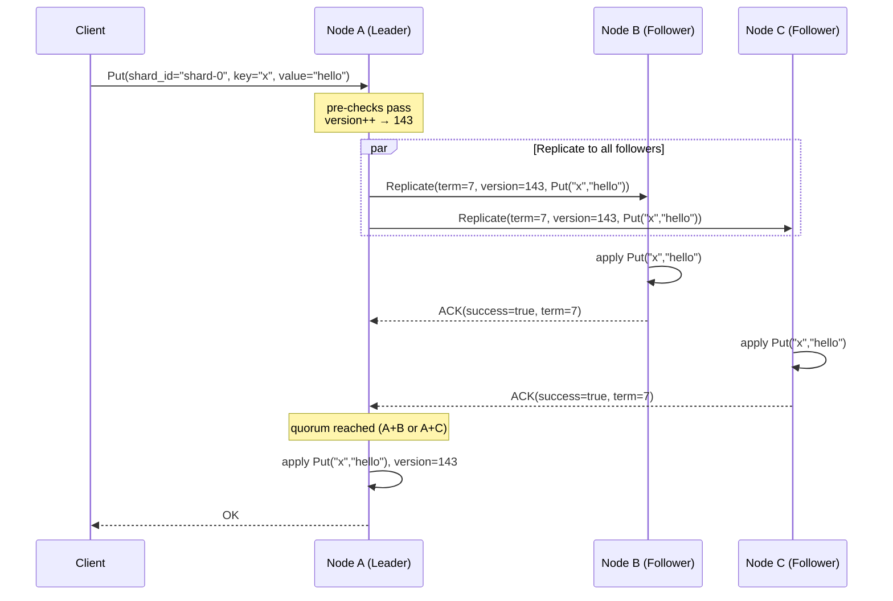
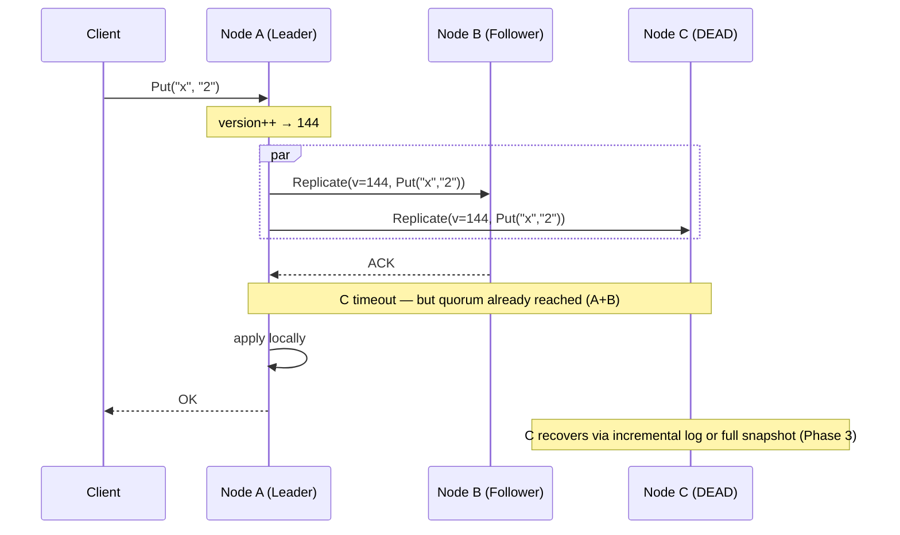
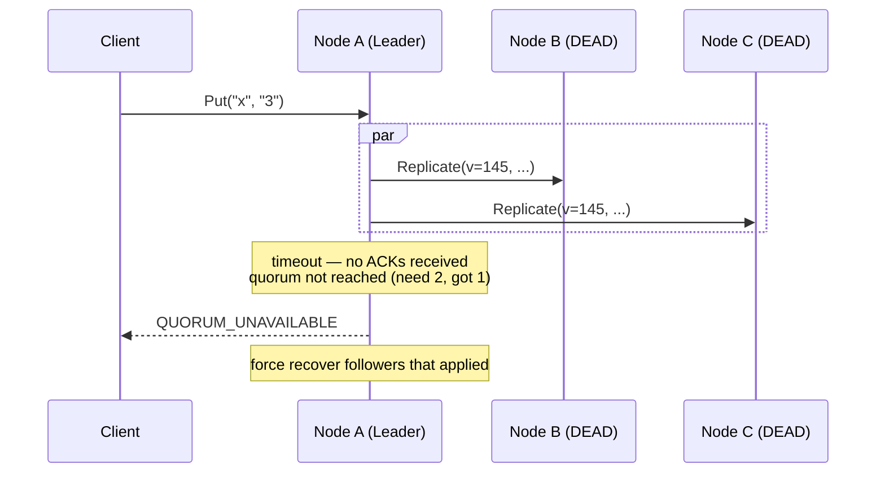
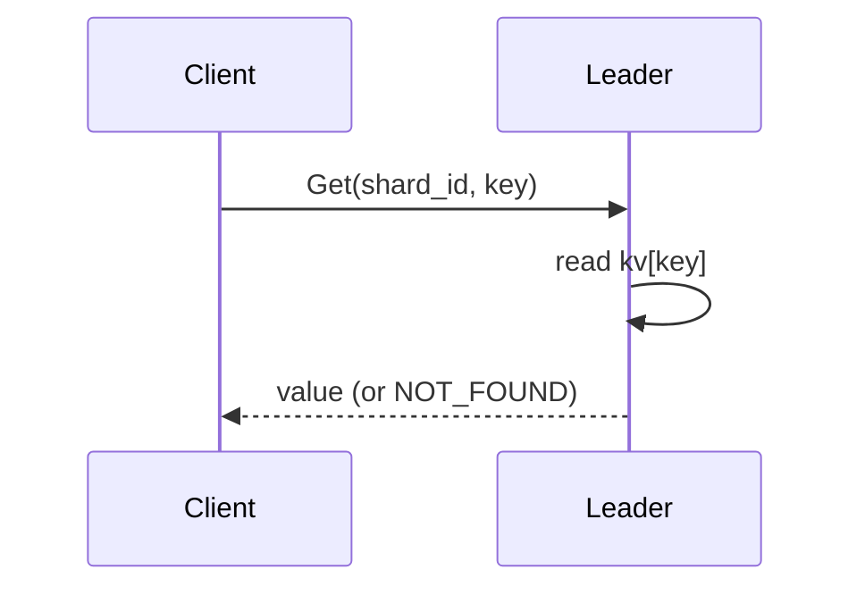
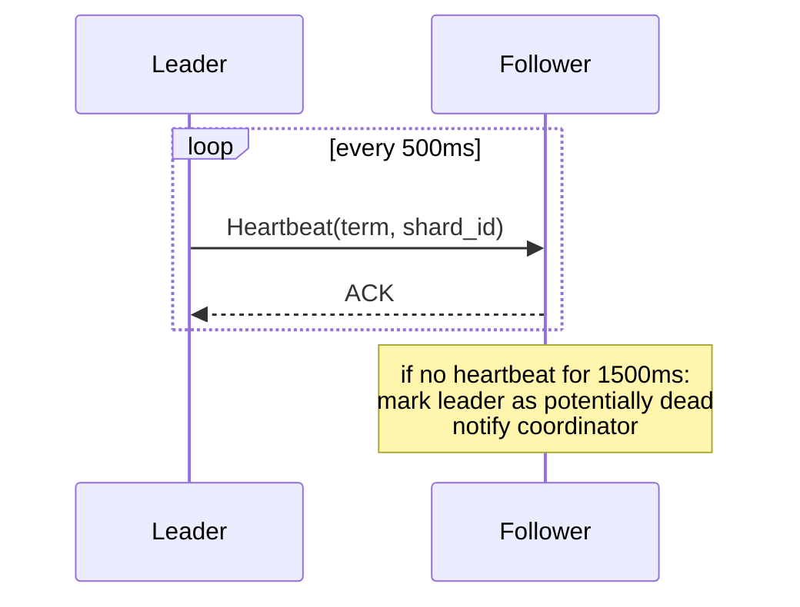
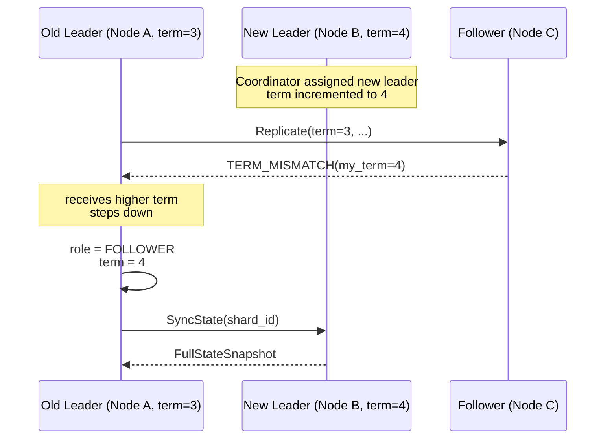
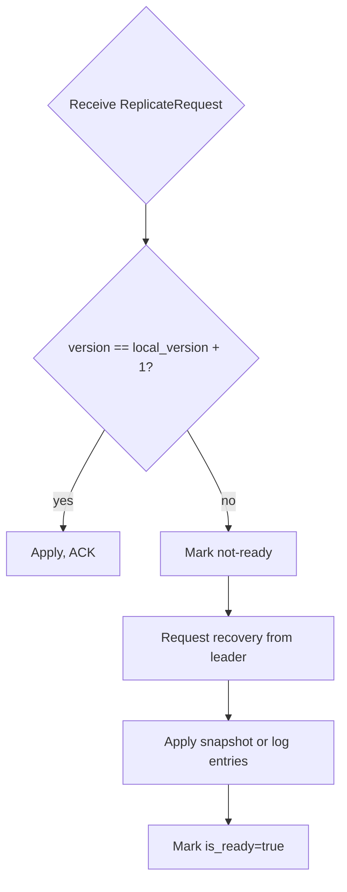
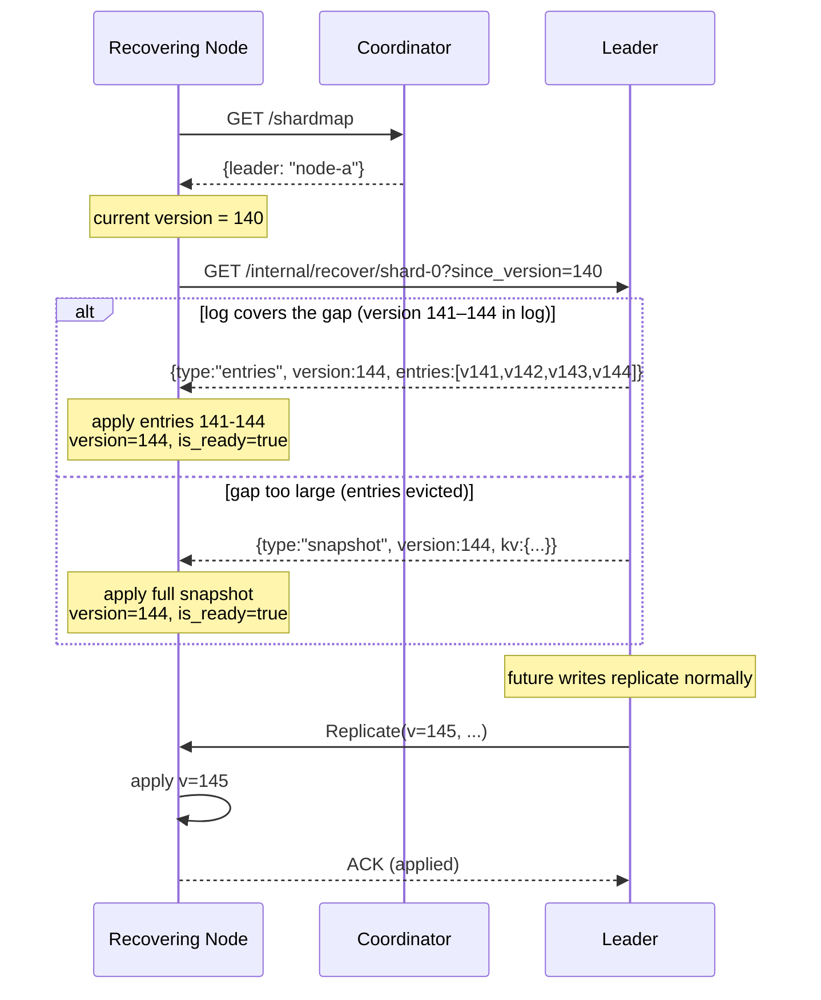
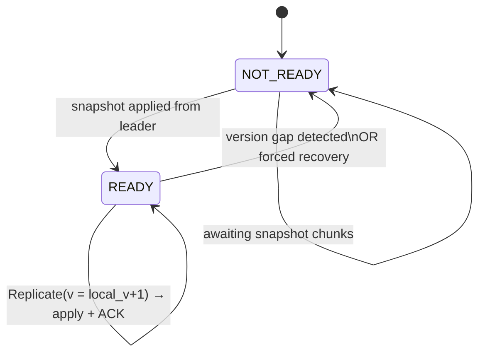

# Doki — Replication Protocol

This document describes the replication protocol in detail: the write path, quorum mechanics, failure handling, and recovery.

---

## Overview

Doki uses **synchronous quorum replication**:

- The leader receives a write from a client
- The leader replicates to all followers in parallel
- Followers apply the write immediately and ACK
- The write is committed when a quorum (majority) of replicas acknowledge **apply**
- The leader applies the write locally and returns success to the client

This design is simple, correct, and easy to reason about. It sacrifices throughput for clarity.

---

## Core Invariants

These invariants must hold at all times:

1. **Single leader per shard.** Only one node acts as leader for a shard at any given term.
2. **Quorum before commit.** A write is never returned as success unless a quorum of replicas have applied it.
3. **Monotonic versions.** The version counter for a shard never decreases.
4. **Leader completeness.** A newly elected leader has seen all committed writes (enforced by leader selection policy: prefer highest-version replica).
5. **Followers trust leader.** A follower never applies writes from a node that is not the current leader (checked via term).

---

## Write Protocol: Step by Step

### Happy Path (3-node shard, quorum=2)



### Follower Failure During Write



### Write Failure (Quorum Unavailable)



---

## Leader Pre-Checks

Before replicating, the leader verifies:

1. It is still the current leader (`role == LEADER`)
2. The shard is ready (`is_ready == true`)
3. It has recently heard from enough followers to form a quorum (fast-fail if quorum is clearly unavailable)

If any check fails, the leader returns an error immediately without attempting replication.

---

## Quorum Counting

```
quorum = floor(n/2) + 1
```

| Replicas | Quorum | Tolerated failures |
|----------|--------|--------------------|
| 1 | 1 | 0 |
| 2 | 2 | 0 |
| 3 | 2 | 1 |
| 5 | 3 | 2 |

The leader counts itself as an implicit ACK. It only needs `quorum - 1` follower ACKs.
Followers marked `not_ready` are excluded from quorum eligibility.
In practice, the leader treats peers as eligible if they have responded recently to
leader heartbeats or replication requests.

---

## Read Protocol

Reads do not involve replication. The leader reads directly from its local KV store.



All committed writes have been applied to the leader before returning `OK`. Therefore, leader reads are always linearizable.

---

## Heartbeat Between Leader and Followers



The leader uses the liveness set (followers that have responded recently) to fast-fail writes when quorum is clearly unavailable.

---

## Term and Stale Leader Detection



Every replication message carries the sender's term. If `response.term > request.term`, the sender is stale and must step down.

---

## Follower Recovery

### Trigger Conditions



### Recovery Protocol (Phase 3: Incremental Log)

The default recovery path uses the leader's in-memory replication log to avoid full snapshot transfers for small gaps.



**Log size default:** 1000 entries (configurable via `replication_log_size` in node config).
**Fallback:** full snapshot when the follower's `since_version` is more than `replication_log_size` writes behind the leader.

### Snapshot Streaming

For large datasets, the snapshot is streamed in chunks:

```
SnapshotChunk {
  shard_id:      ShardId
  term:          uint64
  final_version: uint64   // version at time of snapshot
  chunk_index:   uint32
  is_last:       bool
  entries:       []KVEntry  // batch of key-value pairs
}
```

The follower accumulates chunks until `is_last = true`, then atomically applies the full state.

---

## Divergence Handling

Followers apply entries immediately, but they only keep state that matches the
leader's committed history. If a quorum attempt fails after some followers apply,
the leader forces those followers to recover from its committed snapshot.

---

## Follower State Machine



---

## Recovery Reuse for Shard Migration (Phase 5)

The same incremental recovery protocol (`GET /internal/recover/{shard_id}?since_version=N`) is reused for live shard migration and shard splitting:

**Migration:** When a shard is migrated to new nodes, the new nodes start with `version=0` and call `GET /internal/recover/shard-id?since_version=0` against the current leader. This is exactly the same as a fresh follower joining the shard.

**Split Bootstrap:** When a new shard is split from a source shard, the new shard's nodes have `BootstrapShardID=<source>`. Their recovery loop calls `GET /internal/recover/<source-shard-id>?since_version=0` against the **source shard's leader**, copying the source shard's current KV state as the new shard's initial state. Once recovery completes, the `BootstrapShardID` is cleared and the new shard evolves independently.

This means the replication protocol is the only data transfer mechanism in the system — no separate bulk-load path is needed.

---

## Configuration Reference

| Parameter | Default | Description |
|-----------|---------|-------------|
| `quorum_timeout_ms` | 1000 | Max time leader waits for quorum |
| `replication_timeout_ms` | 500 | Per-follower RPC timeout |
| `heartbeat_interval_ms` | 500 | Leader→follower heartbeat interval |
| `follower_failure_timeout_ms` | 1500 | Time before leader marks follower failed |
| `max_lag_versions` | 1000 | Versions behind before triggering recovery |
| `max_buffered_versions` | 100 | Write buffer size during follower recovery |
| `snapshot_chunk_size` | 1000 | KV entries per snapshot chunk |
| `replication_log_size` | 1000 | Max entries in in-memory replication log |
