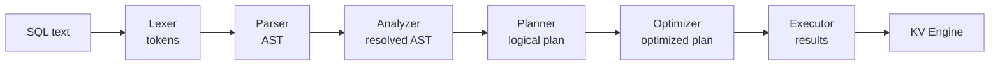
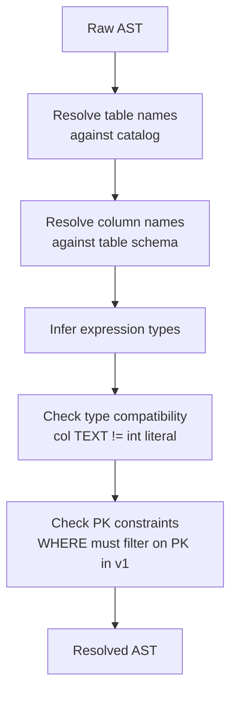
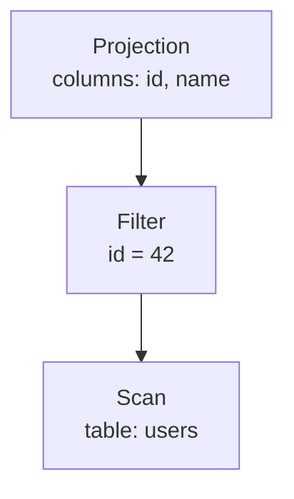
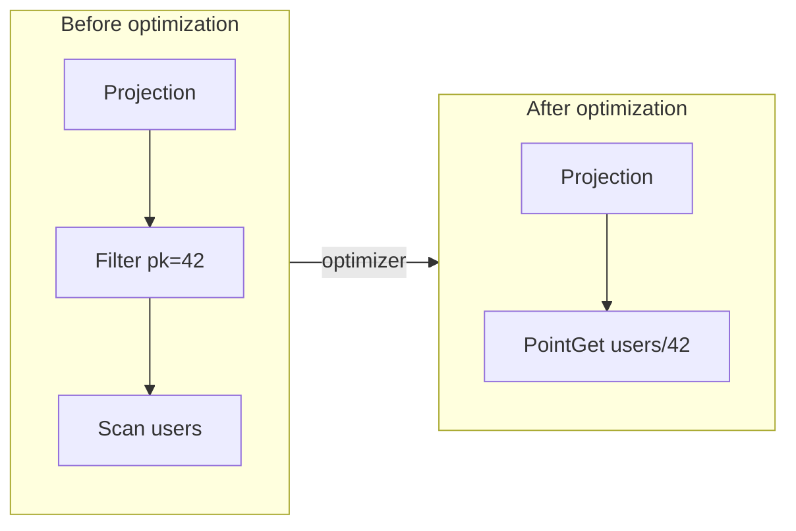
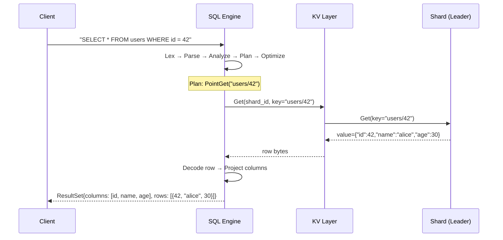
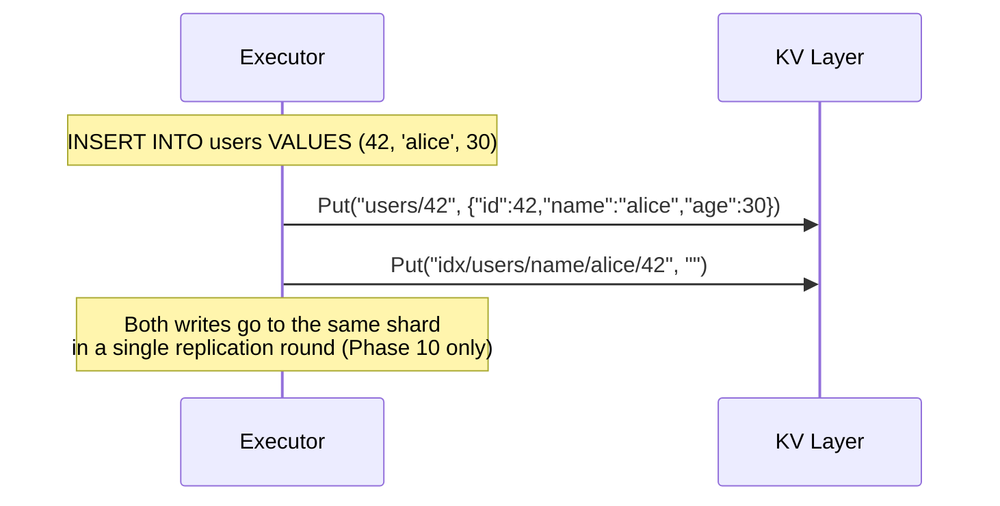
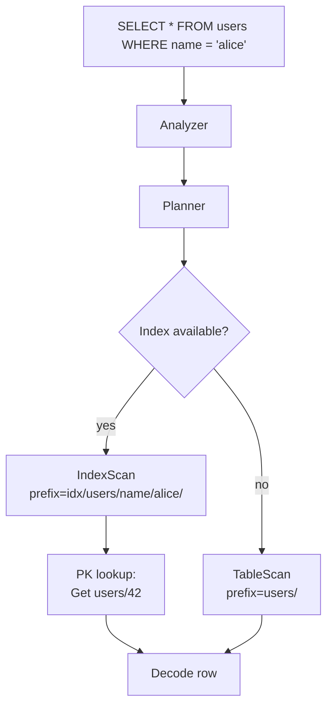
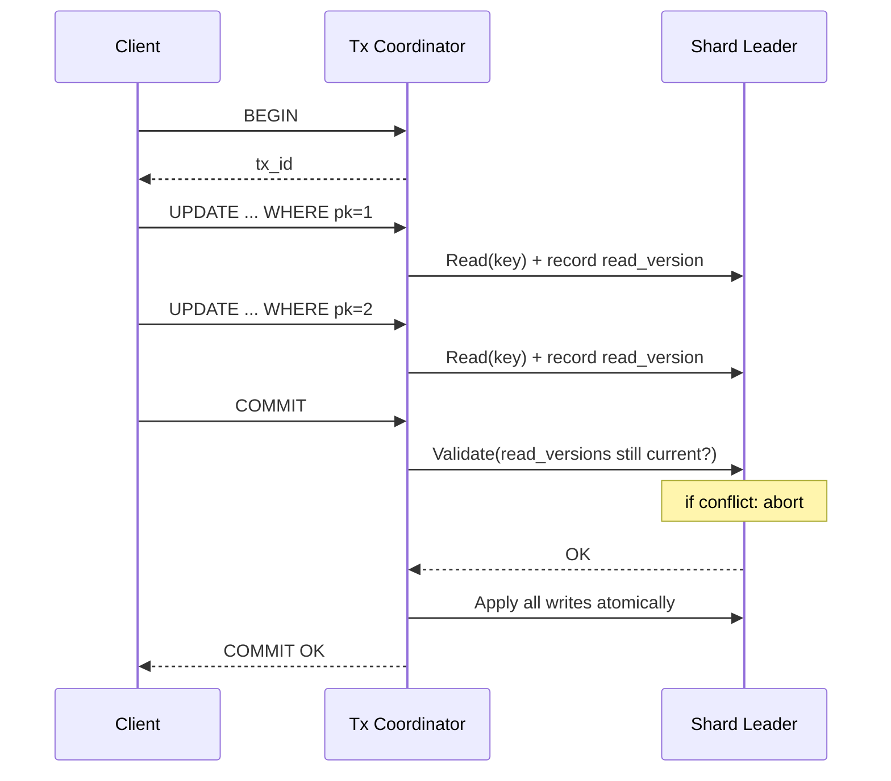
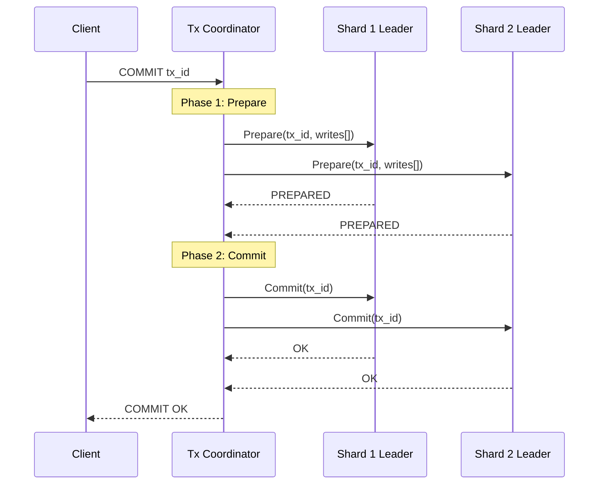

# Doki — Roadmap

This document describes the planned evolution of Doki across multiple phases. Each phase builds on the last and introduces a focused set of new capabilities.

The goal is not speed of delivery. The goal is understanding.

---

## Guiding Principle

Each phase should be:

- **Completable** — has a clear definition of done
- **Testable** — correctness can be verified before moving on
- **Educational** — introduces distinct new distributed systems concepts
- **Stable** — does not leave the system in an inconsistent or broken state

Do not start the next phase until the current phase is solid.

---

## Phase 0: Project Setup ✅ Complete

**Theme:** Infrastructure before code.

**Goals:**
- Repo structure established
- Build system working (Make / bazel / go build)
- Docker Compose cluster launches successfully
- Logging and health endpoint scaffolding in place
- Proto definitions checked in and compiling

**Definition of Done:**
- `docker compose up` starts coordinator + 3 nodes
- All nodes heartbeat successfully
- Health endpoints return valid JSON
- At least one passing integration test (even if trivial)

**Completed:** All goals met. 5 integration tests pass covering coordinator health,
node heartbeat, status endpoint, shard map, and shard role assignment.

---

## Phase 1: In-Memory KV with Replication ✅ Complete

**Theme:** The core protocol. Everything else builds on this.

**New Concepts:**
- Leader/follower replication
- Quorum writes (majority ACK before returning success)
- Term-based stale leader detection
- Full-state snapshot recovery (followers sync from leader on startup)
- Per-shard write serialization (`writeMu`) decoupled from read lock (`mu`)
- Shard map version tracking — nodes detect coordinator updates via heartbeat response

**What Was Built:**
- Coordinator: `ShardVersions` in heartbeat, `TermForShard`, leader prefers highest-version candidate, `/leader/{shard_id}` endpoint, shard map version in heartbeat response
- Node: `POST /kv/{shard_id}` (put/get/delete), `POST /internal/replicate/{shard_id}`, `GET /internal/sync/{shard_id}`, recovery loop for followers
- `node/replication.go`: `fanOutReplicate` fan-out with parallel goroutines and per-timeout context
- `node/recovery.go`: `doRecovery` fetches full KV snapshot; `runRecoveryLoop` polls until ready

**Key Invariants to Test:**
- Single leader per shard
- Committed writes survive 1-node failure in 3-node shard
- Writes fail when quorum unavailable
- Recovered node's state matches leader

**Completed:** All goals met. 6 KV integration tests + 16 node unit tests pass.

```
POST /kv/{shard_id}         {"op":"put","key":"k","value":"v"}
POST /kv/{shard_id}         {"op":"get","key":"k"}
POST /kv/{shard_id}         {"op":"delete","key":"k"}
POST /internal/replicate/{shard_id}   leader→follower write fan-out
GET  /internal/sync/{shard_id}        full state snapshot for recovery
```

---

## Phase 2: Durability (Write-Ahead Log) ✅ Complete

**Theme:** Data that survives a crash.

**New Concepts:**
- Write-ahead logging (WAL): fsync before apply so committed writes survive crashes
- Atomic snapshots: temp-file + rename, never leaves partial snapshot on disk
- Snapshot + WAL truncation: WAL does not grow unbounded
- Startup recovery priority: disk state → skip network recovery

**What Was Built:**
- `internal/wal/` — append-only `wal.jsonl` with one JSON entry per line; `Append` fsyncs before returning; `ReadAll` stops at any corrupt/partial line
- `internal/snapshot/` — atomic `snapshot.json` via temp-file rename; stores `{term, version, kv}`
- `node/diskstate.go` — per-shard manager: `openDiskState`, `load` (snapshot + WAL replay), `appendWAL`, `maybeSnapshot` (triggers every N writes)
- `node/server.go` updated: `InitShards` opens disk state and loads if valid (marks replica ready immediately); `leaderWrite` and `handleReplicate` both append to WAL before applying to memory

**Key Invariants:**
- WAL is written *before* applying to in-memory KV (write-ahead guarantees durability even on crash between write and ACK)
- Snapshot taken atomically; WAL truncated only after snapshot confirmed written
- Corrupt WAL line halts replay; valid prefix is used (partial crash-boundary write is ignored)
- Both leader and follower maintain independent WALs

**Completed:** 5 new durability integration tests pass. Test suite now: 44 unit + 17 integration.

```
internal/wal/wal.go         append-only WAL, fsync per entry
internal/snapshot/snapshot.go  atomic snapshot save/load
node/diskstate.go           per-shard WAL + snapshot manager
```

---

## Phase 3: Incremental Replication Log ✅ Complete

**Theme:** Efficient catch-up without full snapshots.

**New Concepts:**
- Replication log (in-memory bounded circular buffer, distinct from the durable WAL)
- Log-based follower catch-up: send only missing entries instead of full snapshot
- Snapshot fallback when follower lag exceeds the log size
- Duplicate-write protection in `handleReplicate` (idempotent on version re-delivery)

**What Was Built:**
- `internal/replicationlog/` — bounded `Log` type with `Append`, `Since(sinceVersion)`, `OldestVersion`; evicts oldest entry when at capacity
- `ReplicaState.RepLog` — every replica (leader and follower) maintains a replication log; followers that get promoted to leader can serve incremental recovery immediately
- `GET /internal/recover/{shard_id}?since_version=N` — leader responds with `{type:"entries", entries:[...]}` when log covers the gap, or `{type:"snapshot", kv:...}` as fallback
- `doIncrementalRecovery` in `node/recovery.go` — tries `/internal/recover` first; applies log entries or snapshot transparently; replaces `doRecovery` (full snapshot) in the recovery loop
- Duplicate guard in `handleReplicate`: if `req.Version <= replica.Version`, skip and ACK (prevents double-application when replication and recovery race)
- `NodeConfig.ReplicationLogSize` — configurable log buffer size, defaults to 1000

**Key Invariants:**
- Log entries are always appended inside `replica.mu.Lock()`, guaranteeing version-order consistency
- `Since(sinceVersion)` returns `(nil, false)` only when entries have been evicted (gap), never for valid coverage
- Log is populated on both leaders and followers so promotion to leader yields a non-empty log
- Full-snapshot fallback preserves the Phase 1/2 correctness invariants unchanged

**Completed:** 9 new unit tests (replicationlog package) + 6 new integration tests pass.

```
internal/replicationlog/replicationlog.go   bounded in-memory log (circular buffer)
node/replica.go                             RepLog field added to ReplicaState
node/server.go                              handleRecover + log append in leaderWrite/handleReplicate
node/recovery.go                            doIncrementalRecovery replaces full-snapshot loop
GET /internal/recover/{shard_id}            incremental recovery endpoint
```

---

## Phase 4: Distributed Leader Election ✅ Complete

**Theme:** Remove the coordinator as a SPOF for leadership.

**New Concepts:**
- Leader election via voting (Raft-like but simplified)
- Randomised election timeouts to prevent simultaneous elections
- Vote quorum: majority required to win election
- Candidate selection: only grant vote if candidate version >= own version
- Term monotonicity: stale leaders rejected via term comparison

**What Was Built:**
- `node/election.go`: `VoteRequest/Response`, `LeaderHeartbeatRequest/Response`
- `POST /internal/request_vote/{shard_id}` — peers grant/deny vote based on term, version, and prior vote in this term
- `POST /internal/leader_heartbeat/{shard_id}` — leader proves liveness to followers; resets follower election timers
- `runElectionTimer` goroutine — fires election when no leader message received within randomised timeout (default 300–600ms)
- `runLeaderHeartbeat` goroutine — leader sends heartbeats every `LeaderHeartbeat` (default 150ms)
- `startElection` — increments term, requests votes, promotes self on quorum, notifies coordinator
- `notifyCoordinatorElection` — best-effort POST to `POST /notify_leader`; election stands even if coordinator is down
- Coordinator: `NotifyLeader` in `leader.go` accepts distributed election results if term > current term; `POST /notify_leader` handler in `server.go`
- `NodeConfig` additions: `LeaderHeartbeatMs`, `ElectionTimeoutMinMs`, `ElectionTimeoutMaxMs`
- `ReplicaState` additions: `LastLeaderContact`, `VotedFor`, `VotedForTerm`, `ElectionTimeout`

**Design Note:** This is Raft-like but not full Raft. We skip pre-vote, log matching, and some edge cases. The goal is to learn the core election mechanism, not implement production-grade Raft.

**Key Invariants:**
- At most one vote granted per term per node
- Nodes with lower version cannot win election over a more up-to-date peer
- Cluster recovers leadership without coordinator involvement (coordinator notification is best-effort)
- `handleReplicate` and `handleLeaderHeartbeat` both reset `LastLeaderContact`, proving leader liveness via two paths

**Completed:** 11 new unit tests (election handlers + `startElection`) + 3 election integration tests pass.
Coordinator notification works: elected leader updates shard map directly; nodes refetch on next heartbeat.

```
POST /internal/request_vote/{shard_id}      election vote request from candidate
POST /internal/leader_heartbeat/{shard_id}  leader liveness heartbeat → resets election timer
POST /notify_leader                         (coordinator) accept distributed election result
node/election.go                            all Phase 4 election logic
```

---

## Phase 5: Dynamic Sharding ✅ Complete

**Theme:** Cluster can grow and shards can move.

**New Concepts:**
- Dynamic cluster membership: nodes join at runtime without restart
- Shard migration: live replica-set handoff with dual-serving window
- Shard split: new shard bootstrapped from an existing shard's snapshot
- Per-shard goroutine lifecycle: shards start and stop cleanly at runtime

**What Was Built:**
- `coordinator/migration.go`: `MigrationManager` — tracks in-progress migrations; finalises when all incoming replicas catch up (monitored via `VersionForShard` in heartbeat data); also clears bootstrap hints for splits
- `POST /admin/add_node` — registers a new node in membership so it can heartbeat and receive shards
- `POST /admin/migrate_shard` — expands replica set to old ∪ new, records target; background monitor completes swap once all new replicas are ready
- `POST /admin/split_shard` — creates a new shard with `BootstrapSourceShardID`; new nodes fetch initial snapshot from the source shard's leader
- `LeaderManager.InitTerm` — initialises term counter for dynamically-created shards
- `buildShardMapResponse` now sources node addresses from `Membership` (not static config) so new nodes are visible to the cluster
- `ShardInfo.BootstrapSourceShardID` — source-shard hint cleared after all replicas are ready
- `ShardInfo.IncomingReplicas` — migration target tag, visible in `/shardmap` so clients can observe progress
- `ShardMap.SetReplicas`, `SetIncomingReplicas`, `ClearBootstrapSource`, `RemoveShard` — new operations
- Node: `initShardLocked` extracted from `InitShards`; called live when the shard map delivers new assignments
- Node: `startShardGoroutines` / `dropShard` — per-shard `context.CancelFunc` prevents goroutine leaks on drop
- Node: `refetchShardMap` now detects added and removed shards; also updates peer list mid-migration
- `ReplicaState.BootstrapShardID/BootstrapLeaderAddr` — recovery loop fetches from source shard's leader while bootstrapping; cleared after first successful recovery
- Bootstrap leaders are not marked `IsReady` until recovery completes (prevents serving stale-empty reads)

**Key Invariants:**
- One leader per shard at all times — old leader continues serving during the migration window
- Committed writes survive migration — new replicas catch up via the incremental recovery log
- No double-write window during split — source shard continues independently; new shard accepts writes only after bootstrap completes

**Completed:** 4 integration tests (add node, migrate shard, split shard, clients continue during migration) all pass. All 9 pre-existing integration test suites continue to pass.

```
POST /admin/add_node             register new node in cluster membership
POST /admin/migrate_shard        begin live shard migration to new replica set
POST /admin/split_shard          create new shard bootstrapped from existing one
coordinator/migration.go         MigrationManager — background migration monitor
internal/shardmap/shardmap.go    SetReplicas, SetIncomingReplicas, ClearBootstrapSource, RemoveShard
node/server.go                   initShardLocked, startShardGoroutines, dropShard, live refetchShardMap
```

---

## Phase 6: SQL — Lexer, Parser, and Schema ✅ Complete

**Theme:** Turn SQL text into a structured representation the system can work with.

**New Concepts:**
- Lexical analysis (tokenization)
- Recursive descent parsing
- Abstract Syntax Tree (AST)
- Schema management (catalog)
- Table-to-shard mapping

### SQL Compiler Pipeline



### Lexer

The lexer converts raw SQL text into a flat stream of tokens:

```
Token types:
  KEYWORD    SELECT, INSERT, UPDATE, DELETE, CREATE, TABLE, FROM,
             WHERE, INTO, VALUES, SET, PRIMARY, KEY, INT, TEXT, BOOL
  IDENT      user-defined names (table names, column names)
  NUMBER     integer or float literal
  STRING     quoted string literal
  PUNCT      ( ) , ; = != < > <= >=
  EOF
```

The lexer is a simple hand-written scanner. It processes the input character by character, skipping whitespace and comments, and emits tokens.

### Parser

The parser builds an **Abstract Syntax Tree (AST)** from the token stream using recursive descent.

Each SQL statement is one AST node type:

```go
type Statement interface{ statementNode() }

type CreateTableStmt struct {
    TableName string
    Columns   []ColumnDef
}

type InsertStmt struct {
    TableName string
    Columns   []string   // optional explicit column list
    Values    []Expr
}

type SelectStmt struct {
    Columns   []Expr     // * or specific columns
    TableName string
    Where     Expr       // may be nil
}

type UpdateStmt struct {
    TableName  string
    Assignments []Assignment  // col = expr
    Where       Expr
}

type DeleteStmt struct {
    TableName string
    Where     Expr
}
```

Expressions:

```go
type Expr interface{ exprNode() }

type BinaryExpr struct { Left Expr; Op string; Right Expr }
type ColumnRef  struct { Name string }
type Literal    struct { Value any }   // int, string, bool, nil
```

**Supported SQL grammar (v1):**

```sql
-- DDL
CREATE TABLE <name> (<col> <type> [PRIMARY KEY], ...);

-- DML (primary-key-only WHERE in v1)
INSERT INTO <table> [(<cols>)] VALUES (<vals>);
SELECT <cols | *> FROM <table> [WHERE <pk> = <val>];
UPDATE <table> SET <col> = <val> [, ...] WHERE <pk> = <val>;
DELETE FROM <table> WHERE <pk> = <val>;
```

### Schema Catalog

The catalog stores table definitions. It is persisted via the coordinator (stored as a special shard), making schema changes globally visible.

```go
type Catalog interface {
    CreateTable(def TableDef) error
    GetTable(name string) (TableDef, error)
    ListTables() []TableDef
}

type TableDef struct {
    Name       string
    Columns    []ColumnDef
    PrimaryKey string   // column name of the PK
    ShardID    string   // which shard stores this table
}

type ColumnDef struct {
    Name     string
    Type     ColumnType  // INT, TEXT, BOOL
    NotNull  bool
}
```

In v1, each table maps to exactly one shard. No cross-shard tables.

### KV Encoding

Rows are encoded as KV entries:

```
key:   "<table>/<pk_value>"   e.g. "users/42"
value: JSON-encoded row       e.g. {"id":42,"name":"alice","age":30}
```

This encoding is simple to implement and inspect. Row-level encoding (like column-family style) is a future optimization.

**Definition of Done:**
- `CREATE TABLE` stores a schema in the catalog
- `INSERT` encodes a row and calls `Put` on the KV engine
- `SELECT WHERE pk = ?` calls `Get` and decodes the row
- `UPDATE WHERE pk = ?` calls `Get` + `Put`
- `DELETE WHERE pk = ?` calls `Delete`
- Invalid SQL (syntax error, unknown table, wrong column) returns a descriptive error

**What Was Built:**
- `internal/sql/token.go`: 30+ token type constants (keywords, identifiers, literals, punctuation) and `Token` struct
- `internal/sql/lexer.go`: `Lex(input string) ([]Token, error)` — hand-written scanner; case-insensitive keywords; single-quoted strings with `''` escape; `--` line comments
- `internal/sql/ast.go`: `Statement` and `Expr` interfaces; `CreateTableStmt`, `InsertStmt`, `SelectStmt`, `UpdateStmt`, `DeleteStmt`, `BinaryExpr`, `ColumnRef`, `Literal`, `StarExpr`, `Assignment`
- `internal/sql/catalog.go`: `ColumnType` (TypeInt/TypeText/TypeBool), `ColumnDef`, `TableDef`, `Catalog` interface, thread-safe `inMemoryCatalog`, `RowKey`/`EncodeRow`/`DecodeRow` helpers
- `internal/sql/parser.go`: `Parse(input string) (Statement, error)` — recursive descent; full expression grammar (binary ops, AND/OR, all comparison operators, parentheses, NULL/TRUE/FALSE literals)
- 52 passing unit tests (lexer, parser, catalog)

---

## Phase 7: SQL — Analyzer and Type System ✅ Complete

**Theme:** Validate the AST against the schema; catch errors before execution.

**New Concepts:**
- Name resolution
- Type checking
- Semantic validation

### Analyzer

The analyzer takes a parsed AST and resolves all names and types against the catalog. It produces a **resolved AST** (or a typed AST) where every node knows its type.



**Checks performed:**

| Check | Example error |
|-------|--------------|
| Table exists | `relation "orders" does not exist` |
| Column exists | `column "nmae" does not exist` |
| Type match | `cannot assign TEXT to INT column "age"` |
| PK in WHERE | `v1: WHERE must filter on primary key` |
| INSERT column count | `INSERT has 3 columns but 2 values` |
| NOT NULL | `null value in column "name" violates not-null constraint` |

**What Was Built:**
- `internal/sql/analyzer.go`: `Analyze(stmt Statement, cat Catalog) (ResolvedStatement, error)` — produces `ResolvedCreateTable`, `ResolvedInsert`, `ResolvedSelect`, `ResolvedUpdate`, `ResolvedDelete` with `TypedExpr` annotations and `ResolvedWhere` for PK equality predicates
- All semantic checks from table above implemented with descriptive error messages
- 21 passing unit tests covering happy paths and all error cases

---

## Phase 8: SQL — Planner and Optimizer ✅ Complete

**Theme:** Convert the resolved AST into an efficient execution plan.

**New Concepts:**
- Logical plans (relational algebra)
- Physical plans (concrete operations)
- Rule-based optimization
- Plan trees

### Logical Plan

The planner converts the resolved AST into a **logical plan tree** — an operator tree in the style of relational algebra:



Logical operators:

```go
type LogicalPlan interface{ logicalPlanNode() }

type Scan       struct { Table TableDef }
type Filter     struct { Input LogicalPlan; Predicate Expr }
type Projection struct { Input LogicalPlan; Columns []Expr }
type Insert     struct { Table TableDef; Values []Expr }
type Update     struct { Table TableDef; Assignments []Assignment; Filter Expr }
type Delete     struct { Table TableDef; Filter Expr }
```

### Optimizer

The optimizer applies rule-based rewrites to the logical plan. In v1, rules are simple:

| Rule | Description |
|------|-------------|
| **Predicate pushdown** | Move `Filter` nodes as close to `Scan` as possible |
| **PK point lookup** | If `Filter` is `pk = literal`, convert `Scan+Filter` to a single `PointGet` |
| **Projection pushdown** | Only fetch needed columns from storage |

The PK point lookup optimization is critical: it transforms a table scan + filter into a single KV `Get`, which is O(1).



### Physical Plan

The physical planner converts logical plans to **physical plans** that map directly to KV operations:

```go
type PhysicalPlan interface{ physicalPlanNode() }

type KVGet    struct { Key string; Decode func([]byte) Row }
type KVPut    struct { Key string; Value []byte }
type KVDelete struct { Key string }
type KVScan   struct { Prefix string; Decode func([]byte) Row }  // future
```

**What Was Built:**
- `internal/sql/planner.go`: `Plan(rs ResolvedStatement) (PhysicalPlan, error)` with physical plan types: `CreateTablePlan`, `InsertPlan`, `PointGet`, `PointPut`, `PointDelete`, `PointUpdate`, `TableScan`
- Optimizer rules: SELECT with PK = literal WHERE → `PointGet`; SELECT no WHERE → `TableScan`; INSERT → `InsertPlan`; UPDATE → `PointUpdate`; DELETE → `PointDelete`
- `evalLiteralToString` converts int64/string/bool literals to KV key strings
- 8 passing unit tests covering all plan types

---

## Phase 9: SQL — Executor ✅ Complete

**Theme:** Execute physical plans against the KV engine and return results.

**New Concepts:**
- Volcano/iterator model
- Row materialization
- Result encoding

### Executor Model

Doki uses the **volcano (iterator) model**: each physical operator is an iterator with `Open()`, `Next()`, and `Close()` methods.

```go
type Executor interface {
    Open() error
    Next() (Row, error)   // returns (nil, nil) at end
    Close() error
}
```

Operators:

| Operator | Description |
|----------|-------------|
| `PointGetExecutor` | Single KV `Get`; returns 0 or 1 rows |
| `KVScanExecutor` | Prefix scan; returns all matching rows (future) |
| `FilterExecutor` | Wraps another executor; evaluates predicate per row |
| `ProjectionExecutor` | Wraps another executor; projects columns |
| `InsertExecutor` | Encodes row and calls KV `Put` |
| `UpdateExecutor` | `Get` + mutate + `Put` |
| `DeleteExecutor` | KV `Delete` |

### Row Representation

```go
type Row map[string]any   // column name → value

// Encode encodes a row to a JSON byte slice for storage
func Encode(row Row) ([]byte, error)

// Decode decodes a stored byte slice back to a Row
func Decode(data []byte) (Row, error)
```

### Result Set

```go
type ResultSet struct {
    Columns []string
    Rows    []Row
    // For INSERT/UPDATE/DELETE:
    RowsAffected int
}
```

### End-to-End Flow



**Definition of Done:**
- All Phase 6 INSERT/SELECT/UPDATE/DELETE tests still pass
- Optimizer converts PK WHERE to PointGet (verified via plan inspection)
- Executor returns correct ResultSet for each statement type
- Error propagation from KV layer (NOT_FOUND, QUORUM_UNAVAILABLE) surfaces as SQL error

**What Was Built:**
- `internal/sql/executor.go`: `KV` interface (Get/Put/Delete/Scan), `KVEntry`, `ErrNotFound`, `ResultSet{Columns, Rows, RowsAffected}`, `Execute(plan PhysicalPlan, kv KV, cat Catalog) (*ResultSet, error)`
- Handles all plan types: `CreateTablePlan` → catalog.CreateTable; `InsertPlan` → kv.Put; `PointGet` → kv.Get + decode + project; `TableScan` → kv.Scan + decode + project all rows; `PointUpdate` → kv.Get + mutate + kv.Put; `PointDelete` → kv.Delete
- Column projection: nil = all columns in table definition order; explicit = named columns in that order
- 10 end-to-end tests using `inMemoryKV` exercising the full `Parse → Analyze → Plan → Execute` pipeline
- All 100 SQL package tests pass; all existing reliability tests still pass

---

## Phase 10: SQL — Secondary Indexes

**Theme:** Query by non-primary-key columns.

**New Concepts:**
- Index maintenance (write-time index update)
- Index KV encoding
- Index scan in planner
- Consistency between primary row and index entries

### Index KV Encoding

An index on `users(name)` stores entries:

```
key:   "idx/users/name/<name_value>/<pk_value>"   e.g. "idx/users/name/alice/42"
value: "" (empty — the PK is embedded in the key)
```

The full key includes the PK to handle non-unique indexes. A unique index would omit the PK suffix and enforce uniqueness at write time.

### Write Path with Index



### Read Path with Index



### CREATE INDEX

```sql
CREATE INDEX idx_name ON users(name);
CREATE UNIQUE INDEX idx_email ON users(email);
```

The catalog stores index definitions alongside table definitions.

### Limitations (Phase 10)

- Indexes are only supported for single-shard tables (cross-shard index maintenance requires distributed transactions)
- No partial indexes
- No composite indexes
- Index updates are not atomic with the primary write (addressed in Phase 11)

---

## Phase 11: SQL — Multi-Row Transactions

**Theme:** ACID guarantees across multiple SQL statements.

**New Concepts:**
- MVCC (multi-version concurrency control)
- Optimistic locking
- Two-phase commit (2PC)
- Deadlock detection / prevention

### Transaction API

```sql
BEGIN;
UPDATE accounts SET balance = balance - 100 WHERE id = 1;
UPDATE accounts SET balance = balance + 100 WHERE id = 2;
COMMIT;  -- or ROLLBACK;
```

### Single-Shard Transactions

For transactions that touch only one shard, Doki uses **optimistic concurrency control**:



### Multi-Shard Transactions (2PC)



**Known complexity:** 2PC is not resilient to coordinator failure between phases. Full resilience requires persistent transaction logs and recovery logic. This is acceptable as a learning target — implement it, understand the failure modes, then document them.

---

## Summary Table

| Phase | Theme | Key Concept |
|-------|-------|------------|
| 0 | Setup | Infrastructure, CI |
| 1 | In-memory KV | Replication, quorum, recovery |
| 2 | Durability | WAL, fsync, restart recovery |
| 3 | Incremental replication | Log-based catch-up |
| 4 | Distributed election | Raft-like voting |
| 5 | Dynamic sharding | Migration, membership |
| 6 | SQL: Lexer, Parser, Schema | Tokenization, AST, catalog |
| 7 | SQL: Analyzer | Type checking, name resolution |
| 8 | SQL: Planner, Optimizer | Logical plan, rule-based optimization |
| 9 | SQL: Executor | Volcano model, result sets |
| 10 | SQL: Secondary indexes | Index KV encoding, index scans |
| 11 | SQL: Transactions | MVCC, 2PC |

---

## What Not To Build (Yet)

These are intentionally deferred:

- **Compression** — not needed until performance matters
- **Authentication / TLS** — out of scope for a learning system
- **Multi-datacenter replication** — too complex without Raft
- **MVCC** — needed for transactions but complex; deferred to phase 8
- **Query optimizer** — not needed with single-table, primary-key-only SQL
- **Horizontal read scaling** — consistent reads from followers require leases; deferred
- **Geo-distribution** — out of scope
